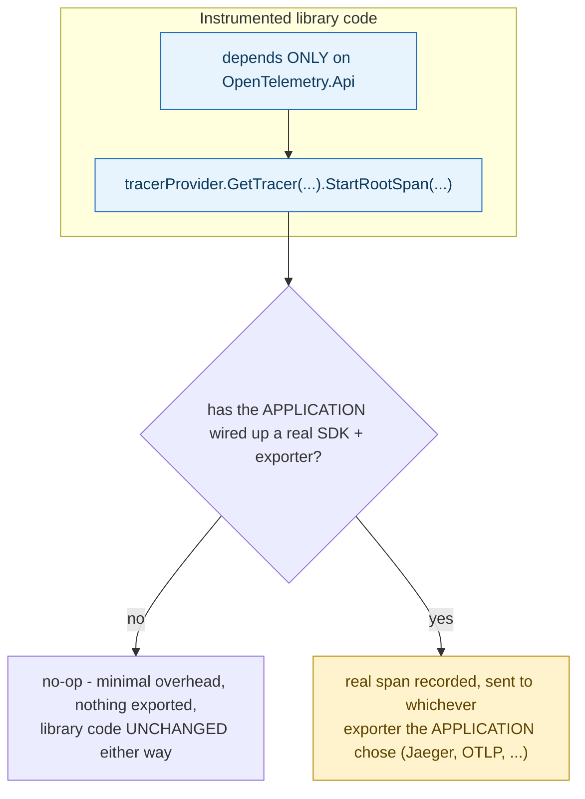

## 1. The Engineering Problem: a library can't know, at the time it's written, whether or how tracing will ever be configured

A library author wants to add tracing instrumentation — recording a span for every outgoing HTTP request their client library makes, say — but they can't know, at the time they write that code, whether the *application* consuming their library will ever configure a real tracing backend, which specific backend it might be (Jaeger, Zipkin, an OTLP collector, something proprietary), or whether tracing will be enabled at all. If the library's instrumentation code required a real, configured backend to function, using that library in an application that hasn't set up tracing would either crash outright or force every single consumer of the library to configure a tracing backend whether they want telemetry or not.

---

## 2. The Technical Solution: instrumented code depends only on a vendor-neutral API that works safely with zero configuration, and the application alone decides what (if anything) actually receives the data

OpenTelemetry splits into a separate **API** package — what instrumented library code depends on — and an **SDK** package plus specific **exporter** packages, which only the application's own entry point wires together. `TracerProvider.Default` is a real, fully functional, no-op-safe instance available with zero configuration at all: library code calling `tracerProvider.GetTracer(...).StartRootSpan(...)` gets back a genuinely usable object whether or not any SDK has ever been configured — with no SDK wired up, the calls simply have no observable effect rather than crashing or requiring the library to add conditional guards checking "is tracing configured?" before every span.



Only the application, at its own entry point, explicitly builds and registers a real `TracerProvider` wired to a specific exporter — and only from that point does tracing actually record and export anything. The library's own source code never changes, never references any specific exporter package, and never knows or cares whether a backend is even listening.

---

## 3. The clean example (concept in isolation)

```csharp
// LIBRARY code - depends ONLY on the API package, works either way
public class HttpClientWrapper {
    private readonly Tracer _tracer = TracerProvider.Default.GetTracer("MyLib");
    public async Task<Response> SendAsync(Request req) {
        using var span = _tracer.StartActiveSpan("http.send");
        return await _inner.SendAsync(req);   // span is real IF the app wired up an SDK, else a no-op
    }
}

// APPLICATION entry point - the ONLY place that picks a real backend
Sdk.CreateTracerProviderBuilder()
    .AddSource("MyLib")
    .AddOtlpExporter()      // <- application's choice, library never references this type
    .Build();
```

---

## 4. Production reality (from `open-telemetry/opentelemetry-dotnet`)

```csharp
// src/OpenTelemetry.Api/Trace/TracerProvider.cs
public class TracerProvider : BaseProvider
{
    /// <summary>Gets the default TracerProvider.</summary>
    public static TracerProvider Default { get; } = new TracerProvider();

    public Tracer GetTracer(string name, string? version) =>
        this.GetTracer(name, version, null, null);
}
```

```csharp
// src/OpenTelemetry.Api/Trace/Tracer.cs
public class Tracer
{
    internal ActivitySource? ActivitySource;   // NULLABLE - genuinely absent when unconfigured

    internal Tracer(ActivitySource? activitySource)
    {
        this.ActivitySource = activitySource;
    }

    public static TelemetrySpan CurrentSpan
    {
        get
        {
            var currentActivity = Activity.Current;
            if (currentActivity == null)
            {
                return TelemetrySpan.NoopInstance;   // safe fallback, NOT an exception
            }
            return new TelemetrySpan(currentActivity);
        }
    }
}
```

What this teaches that a hello-world can't:

- **`TracerProvider.Default` is a real, static, always-available instance — not something a library needs to null-check or wrap in a try/catch before using.** The API is designed so that "no SDK configured" is a completely ordinary, expected, cheap state to operate in, not an error condition — library authors write exactly one code path, and it behaves correctly under both "tracing is fully wired up" and "tracing was never configured at all."
- **`Tracer.ActivitySource` is explicitly typed as nullable (`ActivitySource?`)** — the class's own internal representation acknowledges, at the type level, that a real backing `ActivitySource` might genuinely not exist. This nullability isn't a defensive afterthought; it's the type system directly encoding the API/SDK separation the whole design depends on.
- **`TelemetrySpan.NoopInstance` is a named, reusable singleton returned specifically when `Activity.Current` is null** — rather than constructing a new dummy object on every call or throwing, the API has one designated "nothing is happening" value that behaves predictably and cheaply, which is exactly what keeps the no-configuration path fast enough that library authors don't need to think about whether instrumentation is "worth the overhead" in the unconfigured case.

Known-stale fact: instrumentation is sometimes imagined as requiring a library to directly integrate with a specific vendor or backend — "this library supports Datadog tracing" as a distinct feature from "this library supports Jaeger tracing." OpenTelemetry's actual design makes that framing obsolete for anything built against its API: instrumented code never references a specific backend at all, only the vendor-neutral API surface shown here. Which backend (if any) actually receives the recorded telemetry is decided entirely by the application wiring up an SDK and an exporter — a decision made once, at the application's own entry point, with zero changes required to any library's instrumentation code no matter which backend the application later chooses or switches to.

---

## Source

- **Concept:** OpenTelemetry instrumentation (SDK, exporters, auto-instrumentation)
- **Domain:** observability
- **Repo:** [open-telemetry/opentelemetry-dotnet](https://github.com/open-telemetry/opentelemetry-dotnet) → [`src/OpenTelemetry.Api/Trace/TracerProvider.cs`](https://github.com/open-telemetry/opentelemetry-dotnet/blob/main/src/OpenTelemetry.Api/Trace/TracerProvider.cs), [`Tracer.cs`](https://github.com/open-telemetry/opentelemetry-dotnet/blob/main/src/OpenTelemetry.Api/Trace/Tracer.cs) — the official OpenTelemetry SDK for .NET.
