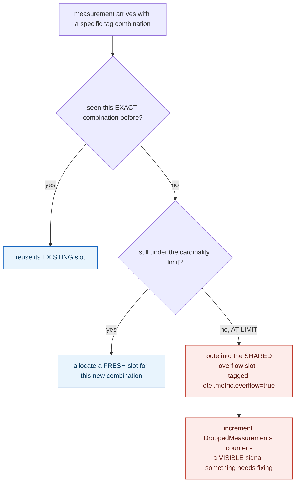

## 1. The Engineering Problem: an unbounded tag value turns one metric into millions of effectively-separate time series

A metric like "HTTP requests, tagged by endpoint and status code" seems entirely reasonable — until a tag with unbounded distinct values sneaks in: a raw user ID, a full URL with query parameters, a UUID. The moment that happens, the metrics backend has to track a genuinely separate time series for every unique *combination* of tag values ever observed — what looked like one metric silently becomes millions of near-unique series, each consuming real memory and storage. This is cardinality explosion, and it doesn't degrade gracefully on its own: unbounded growth in a time-series store can exhaust memory and degrade the entire pipeline, not just the one offending metric.

---

## 2. The Technical Solution: reserve a fixed number of slots, and route anything past the limit into one shared overflow bucket instead of growing without bound

OpenTelemetry's .NET SDK protects against this directly in its metric storage layer. `AggregatorStore` reserves a *fixed* number of metric point slots up front — the configured cardinality limit, plus two extra reserved slots: one for the case of zero tags, and one specifically for **overflow**. When a measurement arrives with a tag combination the store has already seen, it reuses that combination's existing slot. When it's a genuinely new combination and slots are still available under the limit, a fresh slot gets allocated. But once the limit is reached, any *further* new combination doesn't get its own slot at all — it's redirected into the single, pre-reserved overflow slot, merged together with every other combination that also exceeded the limit, tagged explicitly as `otel.metric.overflow=true`.



Memory usage stays bounded no matter how many distinct tag combinations a misconfigured metric produces — the tradeoff is that once overflow triggers, all the excess combinations collapse into one lossy aggregate, losing the ability to distinguish between them. But the SDK also increments a visible, queryable signal (`DroppedMeasurements`) precisely so that overflow isn't a silent data-quality problem — it's an observable fact an operator can alert on and investigate.

---

## 3. The clean example (concept in isolation)

```csharp
int FindOrAllocateSlot(TagCombination tags) {
    if (existingSlots.TryGetValue(tags, out int index))
        return index;                        // reuse

    if (existingSlots.Count < cardinalityLimit)
        return AllocateNewSlot(tags);         // fresh slot, still under limit

    return -1;                                // AT LIMIT - caller redirects to overflow
}

void RecordMeasurement(long value, TagCombination tags) {
    int index = FindOrAllocateSlot(tags);
    if (index < 0) {
        DroppedMeasurements++;
        overflowSlot.Update(value);           // merged into ONE shared bucket
        return;
    }
    slots[index].Update(value);
}
```

---

## 4. Production reality (from `open-telemetry/opentelemetry-dotnet`)

```csharp
// src/OpenTelemetry/Metrics/AggregatorStore.cs
// Increase the CardinalityLimit by 2 to reserve additional space.
// This adjustment accounts for overflow attribute and a case where zero tags are provided.
this.NumberOfMetricPoints = cardinalityLimit + 2;
// Index 0 and 1 are reserved for no tags and overflow

private void UpdateLongMetricPoint(int metricPointIndex, long value, ReadOnlySpan<KeyValuePair<string, object?>> tags)
{
    if (metricPointIndex < 0)
    {
        Interlocked.Increment(ref this.DroppedMeasurements);
        this.InitializeOverflowTagPointIfNotInitialized();
        this.metricPoints[1].Update(value);   // the SHARED overflow slot, index 1
        return;
    }

    this.metricPoints[metricPointIndex].Update(value);
}

private void InitializeOverflowTagPointIfNotInitialized()
{
    if (!this.overflowTagMetricPointInitialized)
    {
        lock (this.lockOverflowTag)
        {
            if (!this.overflowTagMetricPointInitialized)
            {
                var keyValuePairs = new KeyValuePair<string, object?>[] { new("otel.metric.overflow", true) };
                // ... initialize metricPoints[1] with this tag ...
                this.overflowTagMetricPointInitialized = true;
            }
        }
    }
}
```

What this teaches that a hello-world can't:

- **`NumberOfMetricPoints = cardinalityLimit + 2`, not just `cardinalityLimit`** — the two reserved slots (index 0 for zero-tag measurements, index 1 for overflow) are carved out *in addition to* the user-configured limit, explicitly documented as a deliberate design change ("Previously, these were included within the original cardinalityLimit... now explicitly added to enhance clarity"). The comment itself is evidence of a real, previously-ambiguous edge case the maintainers fixed by making the reservation explicit rather than implicit.
- **The overflow slot's own identifying tag, `otel.metric.overflow=true`, is initialized lazily and thread-safely** — via a double-checked lock (`overflowTagMetricPointInitialized` checked, locked, checked again) — because the very first measurement to trigger overflow could arrive from any thread, and the initialization must happen exactly once regardless of how many concurrent measurements are racing to be the one that triggers it.
- **`Interlocked.Increment(ref this.DroppedMeasurements)` runs on every single overflowed measurement, not just the first one** — this isn't a one-time "cardinality limit exceeded" flag; it's a running count of exactly how much data has been lossily merged, giving an operator a concrete magnitude ("thousands of measurements collapsed into overflow" versus "a handful") rather than a binary yes/no signal.

Known-stale fact: cardinality is sometimes treated as purely an abstract guideline — "keep your labels low-cardinality" — with no concrete description of what actually happens if that guideline is violated. This real SDK behavior shows the actual, enforced consequence: exceeding a configured cardinality limit doesn't crash the application, corrupt existing data, or silently drop measurements without a trace. It triggers a deliberate, bounded degradation — everything past the limit merges into one lossy overflow bucket, with a visible counter (`DroppedMeasurements`) and a distinguishing tag (`otel.metric.overflow=true`) marking that it happened. Cardinality protection here isn't just advice for developers to follow; it's runtime behavior with its own observable, alertable signal.

---

## Source

- **Concept:** Metrics types (counters, gauges, histograms) & cardinality
- **Domain:** observability
- **Repo:** [open-telemetry/opentelemetry-dotnet](https://github.com/open-telemetry/opentelemetry-dotnet) → [`src/OpenTelemetry/Metrics/AggregatorStore.cs`](https://github.com/open-telemetry/opentelemetry-dotnet/blob/main/src/OpenTelemetry/Metrics/AggregatorStore.cs) — the official OpenTelemetry SDK for .NET.
