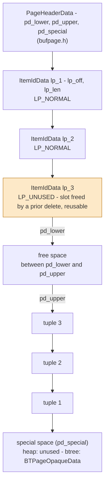
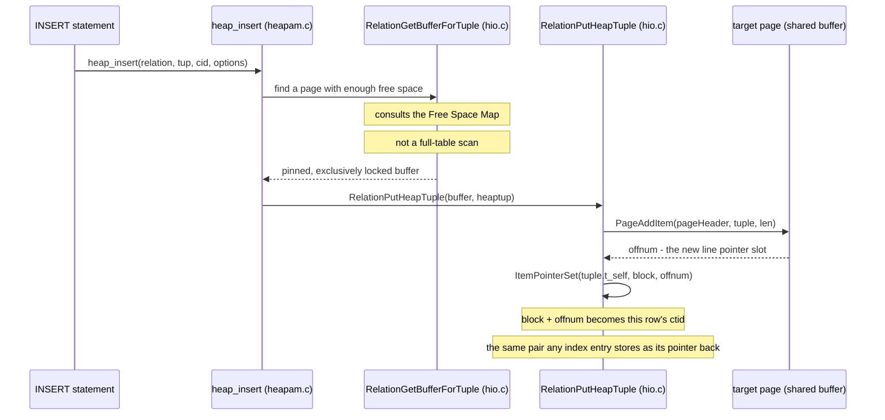
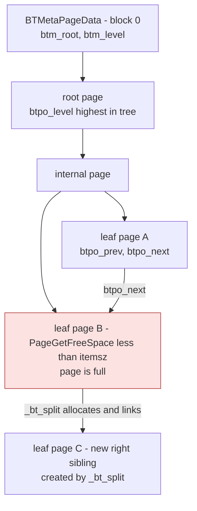

**TL;DR:** What physically IS a "row" and an "index entry" once you're below the SQL layer, and how does a database find one row out of a billion without scanning them all? In Postgres, every table and every B-tree index is built from the exact same fixed-size 8KB **slotted page** — a small header plus an array of indirection pointers ("line pointers") to the actual tuple bytes — and it's that one shared page format, plus a tree of those pages linked by sibling pointers, that both heap storage and index search are built on top of.

## 1. The Engineering Problem: something has to hold a row on disk, in place, and findable

Every earlier lesson in this domain has quietly assumed a table already exists as some durable, updatable, searchable thing. "Relational vs NoSQL data models" talked about rows and documents. "Transactions & ACID" talked about a WAL protecting "the data." "Isolation levels" talked about multiple versions of "a row" being visible to different transactions. None of them asked the more basic question: what IS a row, physically, once it's sitting on disk — and how does a change to one row not mean rewriting the whole file?

The naive answer — append every row to a flat file, find a row later by scanning from the start — fails in two specific ways that matter for a real database engine:

1. **No in-place update.** A flat file has no spare room in the middle. Updating row 40,000 out of a million either means rewriting everything after it, or bolting on an out-of-line "this row moved" scheme that itself needs to be tracked somewhere.
2. **No sub-linear lookup.** Finding one row by primary key means scanning every row before it, every time. That's fine at 100 rows and unusable at 100 million.

A storage engine has to solve both at once: give the buffer pool and the OS a fixed unit of I/O to read and write (so "a page" is a stable, cacheable thing), and give updates and deletes somewhere to happen without rewriting the file — all while still supporting a structure that can find one row without touching every page.

---

## 2. The Technical Solution: one page format, shared by tables and indexes, plus a tree of those pages for search

Postgres's answer to the first problem is the **slotted page** — the same physical layout, `PageHeaderData` plus an `ItemIdData` line-pointer array, used for *both* a table's heap pages and a B-tree index's pages. Its answer to the second problem is to arrange index pages as a **B-tree**: the identical page format, but with sibling pointers and a level number stashed in the page's own "special space," linked together so a search descends `O(log n)` pages instead of scanning `O(n)` rows.

### 2.1 The page: a slotted array, not a flat blob



Line pointers (`ItemIdData`, 4 bytes each) grow **forward** from just after the header. Tuple bytes grow **backward** from the end of the page. `pd_lower` and `pd_upper` are just two offsets marking where each side currently ends — the gap between them is the page's free space. This is the entire trick that solves problem 1: an `UPDATE` or `INSERT` only has to touch the gap in the middle, never rewrite tuples that are already there, and a line pointer can be flipped to `LP_UNUSED` and reused later without moving anything else on the page.

### 2.2 Placing a row: `heap_insert` never addresses a tuple by byte offset directly



`PageAddItem` is the function that actually writes a new `ItemIdData` into the line-pointer array and copies the tuple bytes into the gap below `pd_upper`. It hands back an `offnum` — a line-pointer slot number, not a byte address. `RelationPutHeapTuple` then does `ItemPointerSet(&tuple->t_self, block, offnum)`, and that `(block, offnum)` pair — called the **ctid** — becomes the row's physical identity everywhere else in the system, including inside every index entry that points back at this row.

### 2.3 The index: the identical page format, wearing a different "special space"



A B-tree index is not a separate on-disk format from a heap table — it's built from the same `PageHeaderData`/`ItemIdData` slotted page, just with two differences: the page's "special space" (the region after `pd_special`) holds a `BTPageOpaqueData` with sibling links (`btpo_prev`/`btpo_next`) and a tree level, and the "tuples" stored in the ordinary tuple area are index tuples — a key value plus the heap `ctid` it points at — instead of full rows. A dedicated meta page at block 0 (`BTMetaPageData`) tracks where the current root is, so a search always has a fixed starting block.

Three things to hold onto:

1. **A line pointer is the indirection that makes in-place update possible.** Nothing outside the page ever addresses a tuple by byte offset — always by `(block, line-pointer-offset)`. That's what lets Postgres shuffle tuple bytes around inside a page (during pruning, for example) without invalidating every pointer aimed at it.
2. **A row's ctid and an index entry's pointer-back are the exact same struct**, `ItemPointerData` (`ip_blkid` + `ip_posid`) — an index doesn't have its own separate addressing scheme; it just stores the heap's own coordinates.
3. **A B-tree page split is a direct, checkable condition, not a vague "the index got big" event.** `_bt_insertonpg` compares `PageGetFreeSpace(page)` against the new tuple's size before inserting; if it doesn't fit, `_bt_split()` runs first and hands back a new right sibling, linked in via `btpo_next`/`btpo_prev`.

**Correcting a common assumption:** an index is often pictured as a conceptually different structure from "the table" — a separate file format optimized purely for lookup. In Postgres it's the identical page abstraction from `bufpage.h`, reused wholesale; the bufpage.h header comment says outright that "all blocks written out by an access method must be disk pages," and nbtree is just another access method writing that same page shape.

---

## 3. The clean example (concept in isolation)

A minimal, self-contained illustration of the slotted-page trick — not real Postgres code, just the same idea reduced to a toy 256-byte page so the mechanism is visible without the real struct's alignment/versioning noise:

```c
/* toy_page.c - the slotted-page idea, isolated from real Postgres macros */

#define TOY_PAGE_SIZE   256   /* a real Postgres page is BLCKSZ, 8192 bytes */

typedef struct ToyLinePointer {
    unsigned short offset;    /* byte offset of the tuple, from page start */
    unsigned short length;    /* tuple length in bytes, 0 = unused/reusable */
} ToyLinePointer;

typedef struct ToyPageHeader {
    unsigned short lower;     /* end of the line-pointer array (grows up) */
    unsigned short upper;     /* start of tuple data (grows down) */
} ToyPageHeader;

/*
 * Insert `bytes` (length `len`) into `page`. Returns the new line-pointer
 * slot number, or -1 if the page has no room left between lower and upper.
 */
int toy_page_add_item(char *page, const char *bytes, unsigned short len) {
    ToyPageHeader *hdr = (ToyPageHeader *) page;
    unsigned short new_upper = hdr->upper - len;

    /* the gap between lower and upper is this page's free space */
    if (new_upper < hdr->lower + sizeof(ToyLinePointer))
        return -1;                       /* not enough room - would split */

    memcpy(page + new_upper, bytes, len);        /* tuple grows backward */

    ToyLinePointer *lp = (ToyLinePointer *) (page + hdr->lower);
    lp->offset = new_upper;
    lp->length = len;

    int slot = (hdr->lower - sizeof(ToyPageHeader)) / sizeof(ToyLinePointer);
    hdr->lower += sizeof(ToyLinePointer);        /* line pointers grow forward */
    hdr->upper = new_upper;
    return slot;                          /* this becomes the row's "ctid" offset */
}
```

That's the whole mechanism with the noise stripped out: two offsets, an array that grows one direction, tuple bytes that grow the other, and a slot number handed back instead of a raw address. Section 4 shows the real struct this is modeled on, and the real code that calls the equivalent of `toy_page_add_item` on every `INSERT`.

---

## 4. Production reality (from `postgres/postgres`)

```
postgres/postgres/src/
├── include/storage/
│   ├── bufpage.h    # PageHeaderData - the slotted page shared by heap AND btree pages
│   ├── itemid.h     # ItemIdData - the line pointer / indirection entry
│   └── itemptr.h    # ItemPointerData - the (block, offset) pair used as ctid and as an index's pointer-back
├── include/access/
│   └── nbtree.h      # BTPageOpaqueData / BTMetaPageData - btree's use of a page's "special space"
└── backend/access/
    ├── heap/
    │   ├── heapam.c  # heap_insert - the row-insert entry point
    │   └── hio.c      # RelationPutHeapTuple - places the tuple, sets ctid
    └── nbtree/
        └── nbtinsert.c # _bt_insertonpg / _bt_split - index insert + page-full split
```

```c
// src/include/storage/bufpage.h - PageHeaderData
typedef struct PageHeaderData
{
	/* XXX LSN is member of *any* block, not only page-organized ones */
	PageXLogRecPtr pd_lsn;		/* LSN: next byte after last byte of xlog
								 * record for last change to this page */
	uint16		pd_checksum;	/* checksum */
	uint16		pd_flags;		/* flag bits, see below */
	LocationIndex pd_lower;		/* offset to start of free space */
	LocationIndex pd_upper;		/* offset to end of free space */
	LocationIndex pd_special;	/* offset to start of special space */
	uint16		pd_pagesize_version;
	TransactionId pd_prune_xid; /* oldest prunable XID, or zero if none */
	ItemIdData	pd_linp[FLEXIBLE_ARRAY_MEMBER]; /* line pointer array */
} PageHeaderData;
```

`pd_lower`/`pd_upper`/`pd_special` are exactly the three offsets the diagrams above are drawn from — `pd_linp` is the flexible-array-member line-pointer array itself, living directly inside the header struct rather than as a separate allocation.

```c
// src/include/storage/itemid.h - ItemIdData, the line pointer
typedef struct ItemIdData
{
	unsigned	lp_off:15,		/* offset to tuple (from start of page) */
				lp_flags:2,		/* state of line pointer, see below */
				lp_len:15;		/* byte length of tuple */
} ItemIdData;

#define LP_UNUSED		0		/* unused (should always have lp_len=0) */
#define LP_NORMAL		1		/* used (should always have lp_len>0) */
#define LP_REDIRECT		2		/* HOT redirect (should have lp_len=0) */
#define LP_DEAD			3		/* dead, may or may not have storage */
```

Four bytes total (`unsigned` bitfields packed to 15+2+15). `lp_flags` is exactly the field the amber `LP_UNUSED` node in the page-anatomy diagram is drawn from — a slot in this state has no tuple behind it and is immediately reusable by the next insert on that page, no compaction required.

```c
// src/backend/access/heap/hio.c - RelationPutHeapTuple
void
RelationPutHeapTuple(Relation relation,
					 Buffer buffer,
					 HeapTuple tuple,
					 bool token)
{
	Page		pageHeader;
	OffsetNumber offnum;

	/* ... speculative-insert and infomask assertions elided ... */

	/* Add the tuple to the page */
	pageHeader = BufferGetPage(buffer);

	offnum = PageAddItem(pageHeader, tuple->t_data, tuple->t_len, InvalidOffsetNumber, false, true);
	if (offnum == InvalidOffsetNumber)
		elog(PANIC, "failed to add tuple to page");

	/* Update tuple->t_self to the actual position where it was stored */
	ItemPointerSet(&(tuple->t_self), BufferGetBlockNumber(buffer), offnum);

	/* ... CTID also copied onto the stored tuple itself, unless speculative ... */
}
```

This is the real function the `heap_insert` sequence diagram calls — `PageAddItem` is the production equivalent of `toy_page_add_item` from section 3, and `ItemPointerSet` is where `(block, offnum)` becomes the ctid.

```c
// src/include/access/nbtree.h - BTPageOpaqueData, stored in a btree page's special space
typedef struct BTPageOpaqueData
{
	BlockNumber btpo_prev;		/* left sibling, or P_NONE if leftmost */
	BlockNumber btpo_next;		/* right sibling, or P_NONE if rightmost */
	uint32		btpo_level;		/* tree level --- zero for leaf pages */
	uint16		btpo_flags;		/* flag bits, see below */
	BTCycleId	btpo_cycleid;	/* vacuum cycle ID of latest split */
} BTPageOpaqueData;
```

`btpo_prev`/`btpo_next` are the sibling links drawn in the B-tree diagram — this struct is what lives in the region `pd_special` points to on an index page, the one structural difference from a plain heap page.

```c
// src/backend/access/nbtree/nbtinsert.c - _bt_insertonpg, the page-full check
	/*
	 * Do we need to split the page to fit the item on it?
	 *
	 * Note: PageGetFreeSpace() subtracts sizeof(ItemIdData) from its result,
	 * so this comparison is correct even though we appear to be accounting
	 * only for the item and not for its line pointer.
	 */
	if (PageGetFreeSpace(page) < itemsz)
	{
		Buffer		rbuf;

		/* ... rbuf = _bt_split(rel, heaprel, itup_key, buf, cbuf,
		 *                      newitemoff, itemsz, itup, ...) elided ... */
	}
```

This is the literal condition behind the red `LEAF2` node in the B-tree diagram — `PageGetFreeSpace` reuses the exact same `pd_lower`/`pd_upper` arithmetic from the heap-page diagram, because it's the same page format underneath.

**What this teaches that a hello-world can't:**

- **The same four fields (`pd_lower`, `pd_upper`, `pd_special`, `pd_linp`) govern free-space accounting for both a table and every index on it.** There's no separate "index page manager" in the codebase — `PageGetFreeSpace`, called from `_bt_insertonpg` above, is the same function a heap access-method call would use.
- **A row's ctid isn't a database-level abstraction bolted on top of storage — it's literally the line-pointer slot number `PageAddItem` handed back**, set via `ItemPointerSet` in the exact same call that placed the tuple. There's no separate row-ID generator to reconcile with physical position.
- **An index page split is a size comparison, not a background maintenance event.** `PageGetFreeSpace(page) < itemsz` runs synchronously inside the `INSERT`/index-update path itself, in `_bt_insertonpg` — if a split happens, it happens as part of that one statement's work, not on a schedule.

---

## 5. Review checklist

1. **Don't assume a ctid is a stable, long-term identifier.** It's a physical `(block, offnum)` pair (`ItemPointerData`) — operations that physically rewrite a table (`VACUUM FULL`, `CLUSTER`) change it. Code or migration scripts that cache a ctid across such an operation will silently point at the wrong row.
2. **When a table "looks empty but is still big," check for `LP_UNUSED`/`LP_DEAD` line pointers, not just row count.** A deleted row's slot isn't necessarily removed from the page — the line pointer can sit there until pruning/`VACUUM` reclaims it, so `pd_lower` (and disk usage) doesn't shrink just because a `DELETE` ran.
3. **Wide index keys eat into the same page-size budget as any tuple.** `PageGetFreeSpace(page) < itemsz` is checked against the same fixed page size for every index — a much wider key means fewer entries fit per leaf page, which means more splits and a taller tree for the same row count.
4. **When reasoning about "why did this UPDATE need a page split," remember heap and index pages are governed by the same free-space arithmetic** — a table update can trigger a heap page's own free-space pressure, while the index entries it touches are checked independently against their own leaf pages' `pd_lower`/`pd_upper`.

---

## 6. FAQ

### What is a "line pointer," and why not just point straight at the tuple bytes?
It's `ItemIdData` (`itemid.h`) — a 4-byte `lp_off`/`lp_flags`/`lp_len` entry. The indirection exists so that anything referencing a tuple only ever needs a stable `(block, line-pointer-offset)` pair; the tuple's actual bytes can be pruned or shifted within the page later without invalidating that reference, because the reference points at the slot, not the bytes.

### What actually is a row's ctid?
`ItemPointerData` (`itemptr.h`) — a block number (`ip_blkid`) plus a line-pointer offset (`ip_posid`). `RelationPutHeapTuple` (`hio.c`) sets it directly with `ItemPointerSet(&tuple->t_self, BufferGetBlockNumber(buffer), offnum)`, immediately after `PageAddItem` hands back that `offnum`.

### Is a B-tree index page a fundamentally different disk structure from a table page?
No. Both use the identical `PageHeaderData`/`ItemIdData` layout from `bufpage.h`. The only structural difference is what's stored past `pd_special`: nothing for a heap page, a `BTPageOpaqueData` (sibling links plus tree level) for a btree page — and index tuples hold a key plus a heap ctid instead of a full row.

### What actually triggers a B-tree page split?
The `PageGetFreeSpace(page) < itemsz` check in `_bt_insertonpg` (`nbtinsert.c`), evaluated synchronously as part of inserting a new index tuple. If the new tuple doesn't fit in the page's current free space, `_bt_split()` runs before the insert completes and returns a new right sibling page linked in via `btpo_next`.

### How does a B-tree search know where to start?
Via the dedicated meta page at block 0, `BTMetaPageData` (`nbtree.h`), which stores `btm_root` (the current root block) and `btm_level`. It also tracks a separate "fast root" (`btm_fastroot`) as the current effective entry point for searches, kept distinct from the absolute root for efficiency reasons documented in nbtree's own README.

---

## Source

- **Concept:** Postgres storage engine — heap page/tuple layout and B-tree index page structure
- **Domain:** databases
- **Repo:** [postgres/postgres](https://github.com/postgres/postgres) → [`src/include/storage/bufpage.h`](https://github.com/postgres/postgres/blob/master/src/include/storage/bufpage.h), [`src/include/storage/itemid.h`](https://github.com/postgres/postgres/blob/master/src/include/storage/itemid.h), [`src/include/storage/itemptr.h`](https://github.com/postgres/postgres/blob/master/src/include/storage/itemptr.h), [`src/backend/access/heap/heapam.c`](https://github.com/postgres/postgres/blob/master/src/backend/access/heap/heapam.c), [`src/backend/access/heap/hio.c`](https://github.com/postgres/postgres/blob/master/src/backend/access/heap/hio.c), [`src/include/access/nbtree.h`](https://github.com/postgres/postgres/blob/master/src/include/access/nbtree.h), [`src/backend/access/nbtree/nbtinsert.c`](https://github.com/postgres/postgres/blob/master/src/backend/access/nbtree/nbtinsert.c) — PostgreSQL's own server source, the authoritative implementation of the storage engine itself.

---

**Next in the Databases series:** [What does declaring a shard key actually DO, once you hit save? →]({{ '/databases/relational-vs-nosql-data-models/' | relative_url }})
