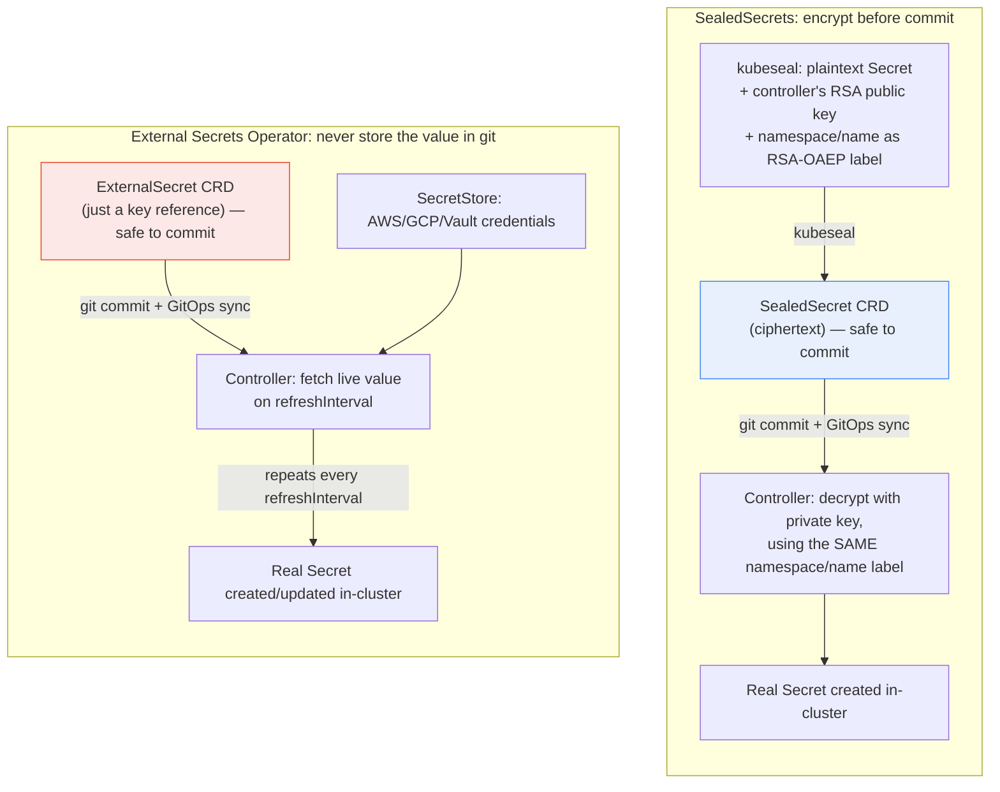

**TL;DR:** A Kubernetes `Secret`'s `data` field is base64, not encryption — committing one to a GitOps repo commits the plaintext value in a thin disguise. `bitnami/sealed-secrets` and `external-secrets/external-secrets` solve this with two genuinely different trust models: SealedSecrets encrypts the value client-side into ciphertext that's cryptographically bound to the exact namespace/name it was sealed for, so it's safe to commit; External Secrets Operator skips storing the value in git (or even in etcd at rest) entirely, syncing it live from an external secret store on a refresh interval instead.

## 1. The Engineering Problem

A GitOps workflow wants everything — including `Secret` objects — declared in git, so the cluster's state is fully reproducible from the repo. But a Kubernetes `Secret`'s `data` field is base64-encoded, not encrypted: `echo -n mypassword | base64` and `base64 -d` round-trip it instantly, with no key involved at all. Committing a real `Secret` manifest to git commits the plaintext, permanently, in the repo's history — visible to anyone with read access to the repo, its CI logs, or any fork, forever, even if the file is later deleted (git history doesn't forget).

The naive fixes don't hold up: keeping secrets in a *different*, access-restricted repo still means the plaintext sits in git somewhere, decryptable by anyone with access to that repo; a `.gitignore`'d local secrets file breaks the entire point of GitOps (the cluster's state is no longer fully described by what's in git); and a manually-applied `kubectl create secret` outside the GitOps flow means the GitOps controller's declared state and the cluster's actual state permanently diverge for that one object.

## 2. The Technical Solution

Two real, differently-shaped answers exist, and they solve the problem in genuinely different ways — not interchangeable defaults for the same mechanism.

**SealedSecrets** encrypts the secret value client-side, before it ever touches git, using a hybrid AES-GCM + RSA-OAEP scheme against the in-cluster controller's public key. The resulting ciphertext is safe to commit — decrypting it requires the controller's private key, which never leaves the cluster. Critically, the encryption also binds the ciphertext to the specific namespace/name (by default) it was sealed for, via the RSA-OAEP "label" parameter — copy-pasting the committed YAML into a different namespace produces a `SealedSecret` the controller *cannot* decrypt.

**External Secrets Operator** takes a different approach: it never puts the secret value in git — or even in etcd — at rest at all. An `ExternalSecret` custom resource in git only *references* a key in an external store (AWS Secrets Manager, GCP Secret Manager, Vault); the operator's controller fetches the live value on a refresh interval and writes it into a real, ordinary `Secret` object at runtime. The plaintext's actual home is always the external store, never the git repo.



Two core truths this diagram is showing:

- **SealedSecrets moves the trust boundary to encryption; External Secrets Operator moves it out of git entirely.** A `SealedSecret` in git is genuinely opaque ciphertext — safe to commit *because* it's encrypted. An `ExternalSecret` in git is safe to commit for a different reason: it never contained the value in the first place.
- **Only External Secrets Operator has a live, recurring sync.** SealedSecrets decrypts once, when the `SealedSecret` object changes; External Secrets Operator re-fetches on every `refreshInterval` tick, so a value rotated in the external store (AWS/GCP/Vault) propagates into the cluster without a new git commit.

## 3. The clean example (concept in isolation)

```yaml
# --- SealedSecrets: the committed artifact is ciphertext ---
apiVersion: bitnami.com/v1alpha1
kind: SealedSecret
metadata:
  name: db-password        # part of the encryption label — must match exactly
  namespace: prod           # part of the encryption label — must match exactly
spec:
  encryptedData:
    password: AgBy3i4OJSWK+PiTySYZZA9rO43cGDEq...  # opaque; decryptable only in-cluster

---
# --- External Secrets Operator: the committed artifact is a reference, not a value ---
apiVersion: external-secrets.io/v1
kind: ExternalSecret
metadata:
  name: db-password
  namespace: prod
spec:
  refreshInterval: 1h        # re-fetch cadence — no value is stored here to leak
  secretStoreRef:
    name: aws-secrets-manager
  target:
    name: db-password         # the real Secret this operator will create/update
  data:
    - secretKey: password
      remoteRef:
        key: prod/db/password  # a lookup key into AWS Secrets Manager, not a value
```

Neither manifest contains a usable plaintext secret — but for structurally different reasons: one is cryptographically opaque, the other simply never held the value.

## 4. Production reality (from the real repo)

```
sealed-secrets/
└── pkg/
    ├── crypto/
    │   └── crypto.go                      — HybridEncrypt/HybridDecrypt (AES-GCM + RSA-OAEP)
    └── apis/sealedsecrets/v1alpha1/
        └── sealedsecret_expansion.go       — EncryptionLabel: scope-binds ciphertext to namespace/name

external-secrets/
└── pkg/controllers/externalsecret/
    └── externalsecret_controller.go        — Reconcile + refreshInterval-driven re-sync
```

SealedSecrets' scope-binding is the mechanism that makes a `SealedSecret` non-portable across namespaces by design — the RSA-OAEP `label` is derived from the object's own namespace and name:

```go
// EncryptionLabel returns the label meant to be used for encrypting a sealed secret according to scope.
func EncryptionLabel(namespace, name string, scope SealingScope) []byte {
	var l string
	switch scope {
	case ClusterWideScope:
		l = ""
	case NamespaceWideScope:
		l = namespace
	case StrictScope:
		fallthrough
	default:
		l = fmt.Sprintf("%s/%s", namespace, name)
	}
	return []byte(l)
}

// RSA-OAEP will fail to decrypt unless the same label is used
// during decryption.
label := labelFor(secret)
ciphertext, err := crypto.HybridEncrypt(rand.Reader, pubKey, plaintext, label)
```

That `label` isn't cosmetic — it's an actual input to the cryptographic scheme, so decryption cryptographically fails, not just policy-fails, if the namespace/name don't match what was sealed:

```go
// HybridEncrypt performs a regular AES-GCM + RSA-OAEP encryption.
func HybridEncrypt(rnd io.Reader, pubKey *rsa.PublicKey, plaintext, label []byte) ([]byte, error) {
	sessionKey := make([]byte, sessionKeyBytes) // random AES-256 key, used once
	// ...encrypt plaintext with AES-GCM using sessionKey...
	// Encrypt symmetric key
	rsaCiphertext, err := rsa.EncryptOAEP(sha256.New(), rnd, pubKey, sessionKey, label)
	// label is bound into the RSA-OAEP encryption itself
}
```

External Secrets Operator's `refreshInterval` drives an ongoing reconcile-and-requeue loop — this is what makes it "live sync," not a one-time fetch:

```go
func (r *Reconciler) getRequeueResult(externalSecret *esv1.ExternalSecret) ctrl.Result {
	refreshInterval := r.RequeueInterval
	if externalSecret.Spec.RefreshInterval != nil {
		refreshInterval = externalSecret.Spec.RefreshInterval.Duration
	}
	if refreshInterval <= 0 {
		return ctrl.Result{} // explicit opt-out of recurring sync
	}
	if externalSecret.Status.RefreshTime.IsZero() {
		return ctrl.Result{RequeueAfter: refreshInterval}
	}
	timeSinceLastRefresh := time.Since(externalSecret.Status.RefreshTime.Time)
	if timeSinceLastRefresh < refreshInterval {
		return ctrl.Result{RequeueAfter: refreshInterval - timeSinceLastRefresh}
	}
	// ...falls through to re-fetch now, refresh interval has elapsed
}
```

What this teaches that a hello-world can't:

- **SealedSecrets' namespace/name binding is enforced by the math, not a policy check.** `EncryptionLabel` feeds directly into `rsa.EncryptOAEP`'s `label` parameter — there's no separate "does this namespace match" `if` statement to bypass; decryption with the wrong label simply produces a cryptographic failure.
- **`ClusterWideScope`/`NamespaceWideScope`/`StrictScope` are a real, explicit tradeoff, not three ways to reach the same result.** `StrictScope` (the default) sets the strongest binding (`namespace/name`); `ClusterWideScope` sets an empty label, deliberately giving up that binding so the same `SealedSecret` can be moved and decrypted anywhere in the cluster — a real portability-vs-blast-radius tradeoff a team makes explicitly via annotation, not an accident of configuration.
- **External Secrets Operator's sync is periodic and explicit about it, not push-triggered.** `RequeueAfter` is computed directly from `Status.RefreshTime` and `Spec.RefreshInterval` — a rotated credential in AWS Secrets Manager doesn't reach the cluster instantly, it reaches it within one `refreshInterval` window, which is a real latency characteristic to design around, not an implementation detail to ignore.

## 5. Review checklist

- **Is a `SealedSecret`'s scope annotation (`StrictScope`/`NamespaceWideScope`/`ClusterWideScope`) an intentional choice, or just whatever `kubeseal`'s default happened to produce?** `ClusterWideScope` trades away the namespace/name binding for portability — verify that tradeoff was made on purpose for a `SealedSecret` that needs to move across namespaces, not left at the default by accident for one that shouldn't.
- **For an `ExternalSecret`, is `refreshInterval` short enough that a rotated/revoked credential in the external store actually propagates to the cluster within an acceptable window?** A `refreshInterval: 24h` on a credential that needs same-hour revocation is a real gap between "revoked in the store" and "no longer live in the cluster."
- **Does anything in the GitOps flow still apply a raw `Secret` manifest directly** (bypassing both mechanisms) **for convenience?** Either mechanism's guarantee only holds if it's actually the only path secrets enter the cluster through — a stray `kubectl create secret` or an un-migrated raw `Secret` manifest defeats the whole point.
- **Is the choice between SealedSecrets and External Secrets Operator driven by where the secret's source of truth should live** (in a cryptographic artifact your team controls, vs. in an external secrets manager your team may already operate) **rather than picked arbitrarily?** They're not interchangeable — a team already running Vault/AWS Secrets Manager for other reasons gets more value from External Secrets Operator's live sync than from re-encrypting values that already have a proper external home.

## 6. FAQ

**Q: If someone gets read access to the git repo, can they decrypt a committed `SealedSecret`?**
A: No — decryption requires the controller's RSA private key, which is generated and stored inside the cluster (as a `Secret` the controller itself manages) and is never committed to git or derivable from the `SealedSecret` object's ciphertext. Read access to the repo only exposes ciphertext bound to a label the reader doesn't control.

**Q: Does External Secrets Operator ever write the fetched value into etcd?**
A: Yes, once it creates the target `Secret` — Kubernetes `Secret` objects are stored in etcd (base64-encoded, same as any other `Secret`, encrypted at rest only if the cluster has etcd encryption-at-rest configured). The distinction this lesson draws is about *git*: External Secrets Operator's `ExternalSecret` object committed to git never contains the value; the real `Secret` it produces still follows normal Kubernetes `Secret` storage semantics once it exists in-cluster.

**Q: Why does `bitnami/sealed-secrets`'s `HybridEncrypt` use both AES-GCM and RSA-OAEP instead of just RSA-encrypting the whole secret?**
A: RSA-OAEP has a maximum plaintext size tied to the key size, far too small for many real secret payloads (a TLS private key, a JSON credentials blob). The hybrid scheme generates a random one-time AES-256 key, encrypts the actual secret with that (no size limit worth worrying about), and only RSA-encrypts the small AES key itself — standard hybrid encryption, not a SealedSecrets-specific shortcut.

**Q: Could a team use both mechanisms in the same cluster?**
A: Yes, and it's a reasonable split — External Secrets Operator for values that already live in a managed secrets store the team operates for other reasons (AWS Secrets Manager, Vault), SealedSecrets for values that don't have an external home and are simplest to just encrypt directly into the GitOps repo. Nothing about either mechanism requires exclusivity.

---

## Source

- **Concept:** Keeping real secret values out of a GitOps-committed manifest
- **Domain:** kubernetes
- **Repo:** [bitnami/sealed-secrets](https://github.com/bitnami/sealed-secrets) → [`pkg/crypto/crypto.go`](https://github.com/bitnami/sealed-secrets/blob/main/pkg/crypto/crypto.go), [`pkg/apis/sealedsecrets/v1alpha1/sealedsecret_expansion.go`](https://github.com/bitnami/sealed-secrets/blob/main/pkg/apis/sealedsecrets/v1alpha1/sealedsecret_expansion.go) (moved from `bitnami-labs/sealed-secrets`, which now redirects here); [external-secrets/external-secrets](https://github.com/external-secrets/external-secrets) → [`pkg/controllers/externalsecret/externalsecret_controller.go`](https://github.com/external-secrets/external-secrets/blob/main/pkg/controllers/externalsecret/externalsecret_controller.go)
