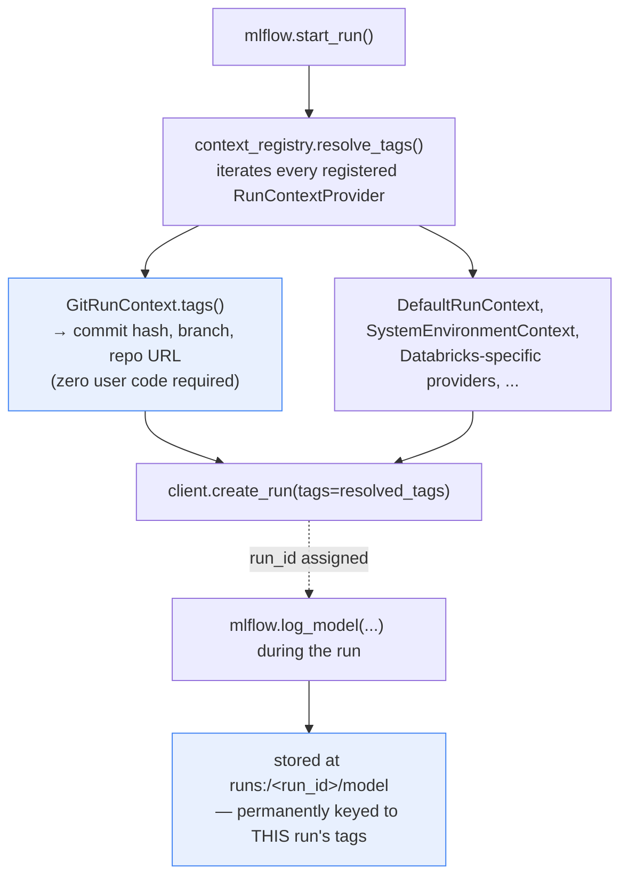

**TL;DR:** Six months after a model ships, can anyone say exactly which code commit, hyperparameters, and dataset version produced it? If that answer depends on someone having remembered to write it down, it's not really guaranteed. MLflow makes it structural instead: every experiment run automatically captures its git commit — no logging call required — and every artifact or model a run produces is stored under a path keyed by that run's own ID, so the model file and its full lineage are permanently the same record, not two things a human has to keep in sync.

## 1. The Engineering Problem

"Which exact code produced this model?" sounds like it should always be answerable, but in practice it often isn't. A model file sits in a directory or a registry with no reliable attached record of which script version trained it, which hyperparameters were used, or which revision of the training data it saw. Manual logging — a README note, a spreadsheet row, a comment in Slack — is opt-in by nature: it depends on someone remembering to do it, under the same deadline pressure that makes it the first thing skipped.

The failure mode isn't hypothetical or rare — it's the default outcome of not having a structural guarantee. Six months later, a team investigating a production model regression needs to know precisely what produced the *currently deployed* model, and "we're not entirely sure" is a genuinely common, genuinely costly answer when reproducibility was left to discipline instead of mechanism.

## 2. The Technical Solution

`mlflow/mlflow`, a real, industry-standard experiment tracking tool, makes two specific things automatic rather than optional:

**Every run automatically captures its git context.** MLflow's tracking client resolves a run's tags through a chain of registered `RunContextProvider`s — one of which, `GitRunContext`, reads the current commit hash, branch, and repo URL directly from git and attaches them as tags, with zero logging calls written by the user. This isn't a feature someone has to remember to enable per-run; it fires automatically every time a run starts, as long as the code is running inside a git repository at all.

**Every artifact a run produces is stored under a path keyed by that run's own ID.** A model or artifact logged during a run isn't saved to some arbitrary path a human has to separately note down — its storage location is `runs:/<run_id>/<artifact_path>`, permanently tying the file to that run's own metadata record (parameters, metrics, and yes, the git commit tag) by construction. There's no second system to keep in sync; the artifact's address *is* a pointer back to its full lineage.



Two core truths this diagram is showing:

- **Git-commit capture is one provider among several in a pluggable registry, not a special case.** `resolve_tags()` doesn't know anything specifically about git — it just calls `in_context()`/`tags()` on every registered provider and merges whatever comes back, which is what lets Databricks-specific context (cluster ID, job ID, notebook path) plug into the exact same mechanism without any special-casing.
- **The artifact URI's dependency on `run_id` is what makes the lineage permanent rather than best-effort.** A model saved this way can't accidentally lose its connection to the run that produced it — the connection is encoded in the storage address itself, not in a separately-maintained record that could drift or get deleted.

## 3. The clean example (concept in isolation)

```python
class RunContextProvider:
    def in_context(self) -> bool: ...
    def tags(self) -> dict: ...

class GitContext(RunContextProvider):
    def in_context(self):
        return get_current_git_commit() is not None
    def tags(self):
        return {"git.commit": get_current_git_commit(), "git.branch": get_current_git_branch()}

def resolve_tags(providers, user_tags):
    all_tags = {}
    for provider in providers:                 # every registered provider gets a turn
        if provider.in_context():
            all_tags.update(provider.tags())     # auto-captured, no user code
    all_tags.update(user_tags)                    # explicit tags win last
    return all_tags

def get_artifact_uri(run_id, artifact_path):
    return f"runs:/{run_id}/{artifact_path}"      # the artifact's address IS the lineage pointer
```

Nothing here requires the caller to remember anything — the reproducibility guarantee is built into what `start_run()` and `log_model()` do by default, not into a checklist someone has to follow.

## 4. Production reality (from the real repo)

```
mlflow/mlflow/tracking/
├── context/
│   ├── git_context.py            — auto-captures commit/branch/repo URL
│   └── registry.py               — resolve_tags(): the provider chain
├── fluent.py                     — start_run() calls resolve_tags()
└── artifact_utils.py             — get_artifact_uri(): run_id-keyed storage path
```

`GitRunContext` reads git state directly — no `mlflow.log_param("git_commit", ...)` call anywhere required from user code:

```python
def _resolve_git_info():
    main_file = _get_main_file()
    if main_file is None:
        return {}
    return {
        MLFLOW_GIT_COMMIT: get_git_commit(main_file),
        MLFLOW_GIT_BRANCH: get_git_branch(main_file),
        MLFLOW_GIT_REPO_URL: get_git_repo_url(main_file),
    }

class GitRunContext(RunContextProvider):
    def in_context(self):
        return self._git_info.get(MLFLOW_GIT_COMMIT) is not None

    def tags(self):
        return {k: v for k, v in self._git_info.items() if v is not None}
```

`resolve_tags()` in the registry is what turns a list of independently-registered providers into one merged tag set for a run — `GitRunContext` is just one entry in this list, alongside several others:

```python
_run_context_provider_registry.register(DefaultRunContext)
_run_context_provider_registry.register(GitRunContext)
_run_context_provider_registry.register(JupyterNotebookRunContext)
_run_context_provider_registry.register(DatabricksNotebookRunContext)
# ...

def resolve_tags(tags=None, ignore=None):
    all_tags = {}
    for provider in _run_context_provider_registry:
        if provider.in_context():
            all_tags.update(provider.tags())
    if tags is not None:
        all_tags.update(tags)
    return all_tags
```

`start_run()` calls this before the run is even created — so the git commit tag exists from the run's very first moment, not as an afterthought logged partway through training:

```python
resolved_tags = context_registry.resolve_tags(user_specified_tags)

active_run_obj = client.create_run(
    experiment_id=exp_id_for_run,
    tags=resolved_tags,
    run_name=run_name,
)
```

And `get_artifact_uri` is what makes every subsequently-logged model or artifact's storage address a function of that same `run_id`:

```python
def get_artifact_uri(run_id, artifact_path=None, tracking_uri=None):
    if not run_id:
        raise MlflowException(
            message="A run_id must be specified in order to obtain an artifact uri!",
        )
    run = store.get_run(run_id)
    # ...constructs the artifact's storage location from this run's own record
```

What this teaches that a hello-world can't:

- **`in_context()` is what makes automatic tagging safe rather than noisy.** `GitRunContext` only contributes tags when it can actually resolve a git commit — running outside a git repo simply omits those tags rather than logging empty or garbage values, so the mechanism degrades gracefully instead of polluting every run with meaningless fields.
- **The provider registry pattern is what lets git-commit capture, Databricks context, and any future context source coexist without special-casing any one of them.** Adding a wholly new kind of auto-captured context (say, a CI pipeline ID) means registering one more `RunContextProvider` — `resolve_tags()`'s loop doesn't change at all.
- **`get_artifact_uri`'s hard requirement for a `run_id` (raising `MlflowException` if missing) is a structural guarantee, not a convention.** It's not possible to save an artifact through this path *without* it being tied to a specific run's tags — the reproducibility link isn't optional, it's a precondition the function itself enforces.

## 5. Review checklist

- **Is training code actually running from a real git checkout (not a detached, uncommitted working tree, or a copied-out script) when a run starts** — since `GitRunContext.in_context()` depends on there being a resolvable commit to report at all?
- **For any custom or organization-specific context that matters for reproducibility** (a specific data-versioning system's revision ID, an internal job scheduler's run ID) **is there a registered `RunContextProvider` capturing it automatically, or is it still relying on someone remembering to log it by hand?** The registry pattern exists specifically so this doesn't have to be a manual habit.
- **Does anything in the training/deployment pipeline save a model file *outside* the `runs:/<run_id>/...` artifact mechanism** — a manual `model.save("some/path")` alongside the tracked run, for instance — which would silently create a model with no structural link back to its producing run?
- **When a production model needs its lineage traced, is the process actually "look up the model's run_id, read its tags" — or does it still require someone's memory or a separate spreadsheet?** If it's the latter, the automatic mechanism this lesson describes likely isn't the one actually in use for that model.

## 6. FAQ

**Q: What happens if two context providers both try to set the same tag key?**
A: `resolve_tags()`'s own docstring is explicit about this: providers are resolved in registration order, and a later provider's tags for the same key overwrite an earlier one's — "registered run context providers can return tags that override those implemented in the core library." Explicit `tags` passed to `start_run()` are applied last of all, so a caller can always override an auto-captured value if genuinely necessary.

**Q: Does this automatic git-commit capture work the same way for a run kicked off from a Jupyter notebook, where there may be uncommitted or interactive-only changes?**
A: The git commit tag reflects whatever the working tree's `HEAD` commit is at run time — it captures the last *committed* state, not uncommitted edits made interactively since then. A notebook run with uncommitted changes still gets a real, useful commit tag; it just doesn't (and structurally can't) capture the exact uncommitted diff, which is a real, known limitation of commit-based lineage in general, not specific to MLflow's implementation.

**Q: Is `runs:/<run_id>/<artifact_path>` a literal filesystem path, or something more abstract?**
A: It's a logical MLflow URI scheme, not necessarily a literal filesystem path — the actual artifact storage backend (local disk, S3, Azure Blob Storage, etc.) is configurable, and `runs:/` URIs are resolved through the tracking store to whatever the real underlying location is. The `run_id`-keying guarantee holds regardless of which physical backend is configured underneath.

**Q: Could a team achieve the same reproducibility guarantee without a tool like MLflow, just through disciplined manual logging?**
A: In principle yes, but that's exactly the fragile "depends on someone remembering" state this lesson opens with — MLflow's contribution isn't a new idea (log the commit, tie artifacts to the run), it's making that idea structural and automatic rather than a process teams have to maintain discipline around indefinitely.

---

## Source

- **Concept:** Automatic experiment-run lineage and reproducibility
- **Domain:** mlops
- **Repo:** [mlflow/mlflow](https://github.com/mlflow/mlflow) → [`mlflow/tracking/context/git_context.py`](https://github.com/mlflow/mlflow/blob/master/mlflow/tracking/context/git_context.py), [`mlflow/tracking/context/registry.py`](https://github.com/mlflow/mlflow/blob/master/mlflow/tracking/context/registry.py), [`mlflow/tracking/artifact_utils.py`](https://github.com/mlflow/mlflow/blob/master/mlflow/tracking/artifact_utils.py) — the industry-standard open-source experiment tracking and model registry
