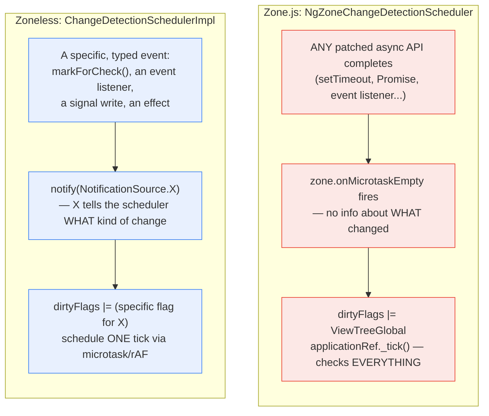

**TL;DR:** Does Angular trigger change detection because it specifically knows which component's state just changed, or because *something* async finished somewhere in the whole application? With Zone.js, it's the second one — any of the dozens of global async APIs Zone.js monkey-patches (`setTimeout`, `Promise`, event listeners) emptying its microtask queue triggers a full, application-wide check, with zero information about what actually changed. Zoneless replaces that blanket trigger with typed, explicit notifications — a `NotificationSource` enum value that sets a *specific* dirty flag — so the scheduler knows something closer to what actually needs checking, not just that time passed.

## 1. The Engineering Problem

Angular needs to know when to re-render a component tree after its state changes — but the naive options are both bad. Constantly polling for changes wastes CPU checking things that never changed. Requiring developers to manually call `detectChanges()` after every state mutation is exactly the kind of easy-to-forget discipline that produces stale-UI bugs the moment someone writes an async callback and doesn't remember the manual call.

Zone.js, Angular's original solution, fixed the "forgetting to call it" problem by never requiring a manual call at all — it monkey-patches nearly every async browser API (`setTimeout`, `Promise.then`, `addEventListener`, XHR callbacks) so Angular is automatically notified whenever *any* patched async operation completes anywhere in the app. That guarantees change detection runs after real state-changing work — but it comes at a real cost: Zone.js's notification carries no information about *which* component's state actually changed, only that *some* async callback, somewhere, just finished. Angular's only correct response to "something happened, no idea what" is to check the entire component tree.

## 2. The Technical Solution

**Zone-based scheduling reacts to a global, contentless signal.** `NgZoneChangeDetectionScheduler` subscribes to `zone.onMicrotaskEmpty` — an event Zone.js fires after its patched microtask queue drains, regardless of which specific async callback caused that. The subscription's response is unconditional: set a `ViewTreeGlobal` dirty flag and call `applicationRef._tick()`, a full-tree check, every time.

**Zoneless scheduling reacts to typed, specific notifications.** `ChangeDetectionSchedulerImpl.notify()` takes a `NotificationSource` — a real enum distinguishing *why* it was called (`Listener`, `MarkForCheck`, `SetInput`, `RootEffect`, `DeferBlockStateUpdate`, and others) — and maps each source to a *specific* dirty flag (`ViewTreeCheck`, `ViewTreeTraversal`, `RootEffects`, `AfterRender`). The scheduler still ends up scheduling one tick either way, but it does so with actual information about what kind of change triggered it, rather than an undifferentiated "something happened."



Two core truths this diagram is showing:

- **Zone.js's signal is a side effect of async plumbing, not a description of application state.** `onMicrotaskEmpty` fires because the JavaScript event loop's microtask queue is empty — a fact about timing, not about which `@Input()` changed or which signal was written.
- **Zoneless's `NotificationSource` enum is the entire mechanism that makes targeted dirty-flagging possible.** Without knowing *why* `notify()` was called, the scheduler would have no more information than Zone.js's blanket signal — the type distinction is what earns the more precise dirty flag.

## 3. The clean example (concept in isolation)

```typescript
// Zone-style: react to a contentless "something happened" signal.
zone.onMicrotaskEmpty.subscribe(() => {
  appRef.dirtyFlags |= DirtyFlags.Everything;
  appRef.tick();  // full-tree check, every time, regardless of cause
});

// Zoneless-style: react to a typed, specific notification.
enum NotificationSource { Listener, MarkForCheck, SetInput, RootEffect }

function notify(source: NotificationSource) {
  switch (source) {
    case NotificationSource.RootEffect:
      appRef.dirtyFlags |= DirtyFlags.RootEffects;       // narrow
      break;
    case NotificationSource.Listener:
    case NotificationSource.MarkForCheck:
    case NotificationSource.SetInput:
      appRef.dirtyFlags |= DirtyFlags.ViewTreeCheck;      // still broad, but a KNOWN category
      break;
  }
  scheduleTickIfNeeded();
}
```

Zone's version has exactly one thing to say: "check everything." Zoneless's version can say one of several specific things, even if some of those things are still fairly broad — the difference is having categories at all, rather than one undifferentiated signal.

## 4. Production reality (from the real repo)

```
angular/packages/core/src/change_detection/scheduling/
├── ng_zone_scheduling.ts             — Zone-based: onMicrotaskEmpty → full tick
└── zoneless_scheduling_impl.ts        — Zoneless: typed notify() → specific dirty flags
```

The Zone-based scheduler's entire trigger condition is "the microtask queue emptied" — nothing in this code path knows or asks what caused that:

```typescript
this._onMicrotaskEmptySubscription = this.zone.onMicrotaskEmpty.subscribe({
  next: () => {
    if (this.changeDetectionScheduler.runningTick) {
      return;
    }
    this.zone.run(() => {
      try {
        this.applicationRef.dirtyFlags |= ApplicationRefDirtyFlags.ViewTreeGlobal;
        this.applicationRef._tick();
      } catch (e) {
        this.applicationErrorHandler(e);
      }
    });
  },
});
```

The zoneless scheduler's `notify()` is a real dispatch over what actually happened, each case setting a narrower flag than "everything":

```typescript
notify(source: NotificationSource): void {
  switch (source) {
    case NotificationSource.MarkAncestorsForTraversal:
    case NotificationSource.DeferBlockStateUpdate: {
      this.appRef.dirtyFlags |= ApplicationRefDirtyFlags.ViewTreeTraversal;
      break;
    }
    case NotificationSource.DebugApplyChanges:
    case NotificationSource.MarkForCheck:
    case NotificationSource.Listener:
    case NotificationSource.SetInput: {
      this.appRef.dirtyFlags |= ApplicationRefDirtyFlags.ViewTreeCheck;
      break;
    }
    case NotificationSource.RootEffect: {
      this.appRef.dirtyFlags |= ApplicationRefDirtyFlags.RootEffects;
      break;
    }
    // ...more specific cases, each mapping to a specific flag
  }

  if (!this.shouldScheduleTick()) {
    return;
  }

  const scheduleCallback = this.useMicrotaskScheduler
    ? scheduleCallbackWithMicrotask
    : scheduleCallbackWithRafRace;
  this.pendingRenderTaskId = this.taskService.add();
  this.cancelScheduledCallback = this.ngZone.runOutsideAngular(() =>
    scheduleCallback(() => this.tick()),
  );
}
```

What this teaches that a hello-world can't:

- **`ViewTreeGlobal` versus `ViewTreeCheck`/`ViewTreeTraversal`/`RootEffects` is the concrete difference between "no information" and "some information."** Zoneless still isn't doing per-component fine-grained invalidation at this layer (that's what `OnPush` plus signals' own dependency tracking handles inside the actual check) — but it enters that check already knowing broadly what kind of change triggered it, which Zone-based scheduling structurally cannot know.
- **Zoneless explicitly schedules its own tick via `scheduleCallbackWithMicrotask`/`scheduleCallbackWithRafRace`**, chosen deliberately (`useMicrotaskScheduler`), rather than piggybacking on a side effect of a monkey-patched global API queue draining. The timing of when a check happens is Angular's own decision in zoneless mode, not an emergent property of Zone.js's patched event loop.
- **`Listener` notifications are treated specially in the zoneless path** (per the comment in `notify()`'s early-return check) **specifically to ease migration from Zone-based `OnPush` components** — a concrete sign this is a real, evolved production mechanism handling backward compatibility, not a clean-slate rewrite with no regard for existing code.

## 5. Review checklist

- **For a component still relying on Zone.js's automatic full-tree checks, is it actually using `OnPush` change detection** — since without it, Zone's already-blunt "check everything" gets *more* expensive per component, not less, as every check re-evaluates that component's bindings regardless of whether anything relevant changed?
- **When migrating a component to zoneless, does any of its state-changing code run through something the zoneless scheduler doesn't automatically observe** (e.g. a third-party library mutating state directly, outside signals or `markForCheck()`) — since zoneless has no monkey-patched global fallback to catch an unnotified change the way Zone.js incidentally would?
- **Is `RootEffect`/`ViewEffect`-sourced work actually expected to need a full traversal, or could it be scoped more narrowly** — the fact that the zoneless scheduler already distinguishes these notification sources suggests there's a real, intentional judgment call behind each dirty-flag mapping, worth understanding before assuming any two notification sources are interchangeable.
- **Does application code depend on change detection happening synchronously after a specific event**, an assumption Zone.js's `onMicrotaskEmpty` timing made easy to fall into by accident — since zoneless's explicit microtask/rAF-race scheduling may resolve at a subtly different point in the timing sequence?

## 6. FAQ

**Q: Does zoneless mode remove Zone.js from the application entirely?**
A: That's the point of the feature, yes — an app configured for zoneless via `provideZonelessChangeDetection()` doesn't need to load or run Zone.js's global monkey-patching at all, which is also why zoneless is frequently cited for reducing bundle size and removing the overhead of patching browser APIs the app may not even use asynchronously in ways Zone.js cares about.

**Q: If zoneless still ends up scheduling a tick for broad categories like `ViewTreeCheck`, is it really more precise than Zone.js in practice?**
A: Yes, in the sense that matters most: it's precise about *why* a tick is needed, which lets other parts of the dirty-flag system (like `RootEffects` running independently of a full view-tree check) skip work Zone's undifferentiated model couldn't skip. It's not claiming per-component omniscience at the scheduler layer — that finer-grained skipping is a separate, complementary mechanism (`OnPush` plus signals' dependency tracking) layered on top of knowing *which category* of work is pending.

**Q: Why does the zoneless `notify()` code specifically special-case `Listener` notifications when zoneless is disabled?**
A: Because under Zone.js, event listeners already run inside the Angular zone and automatically trigger `onMicrotaskEmpty`-driven checks — so a `Listener`-sourced `notify()` call in that mode would be redundant. The special-case exists purely so a codebase migrating incrementally between the two models doesn't get double-triggered checks while transitioning.

**Q: Is `useMicrotaskScheduler` vs. `scheduleCallbackWithRafRace` a meaningful choice, or just an internal implementation detail?**
A: It's a real, deliberate tradeoff — a microtask-scheduled tick runs sooner (before the next paint), which matters for certain synchronous-feeling update expectations, while racing against `requestAnimationFrame` aligns the check with the browser's own render timing, which can reduce redundant work when multiple notifications arrive before the next actual paint. Which one is active depends on the scheduler's own internal state (`this.useMicrotaskScheduler`), not a fixed constant.

---

## Source

- **Concept:** Zone.js-based vs. zoneless Angular change detection scheduling
- **Domain:** angular
- **Repo:** [angular/angular](https://github.com/angular/angular) → [`packages/core/src/change_detection/scheduling/ng_zone_scheduling.ts`](https://github.com/angular/angular/blob/main/packages/core/src/change_detection/scheduling/ng_zone_scheduling.ts), [`packages/core/src/change_detection/scheduling/zoneless_scheduling_impl.ts`](https://github.com/angular/angular/blob/main/packages/core/src/change_detection/scheduling/zoneless_scheduling_impl.ts) — the Angular framework's own source
