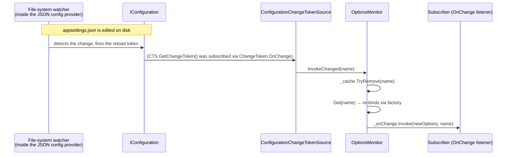

**TL;DR:** Does `IOptionsMonitor<T>` poll `appsettings.json` on a timer to notice when a value changes? No — it never polls anything itself. It subscribes once to `IConfiguration`'s own reload token, a push-based primitive that a specific provider (the JSON file provider's own file-system watcher, for instance) fires when it actually detects a change. When that token fires, the monitor invalidates its cached options and re-binds on the next read — no restart, no polling loop, and no reload logic duplicated inside `IOptionsMonitor` itself.

## 1. The Engineering Problem

The most naive way to read configuration is to parse `appsettings.json` once at startup into a static object and never look at it again. That's fine for values that genuinely can't change during a running process — but it's the wrong answer for a value operations needs to tune live (a feature flag, a rate limit, a log verbosity threshold) without a full redeploy and restart. The opposite naive approach — re-reading the file on every single access — wastes work on every read and risks reading a file mid-write, producing a torn, invalid parse.

What's actually needed is something in between: a value that stays cached and cheap to read most of the time, but updates itself — and lets interested code react — the moment the underlying configuration source genuinely changes, without any component having to poll for that change on its own.

## 2. The Technical Solution

The built-in Options pattern splits config access into three interfaces specifically to make this distinction explicit: `IOptions<T>` (bound once at startup, cached forever — safe to inject into a singleton because it never changes and never needs to), `IOptionsSnapshot<T>` (recomputed once per scope, e.g. once per HTTP request), and `IOptionsMonitor<T>` (long-lived and reload-aware, safe to inject into a singleton, exposing a `CurrentValue` property that reflects the latest bound value and an `OnChange` event for reacting to updates).

`IOptionsMonitor<T>`'s reload mechanism is push-based, not polling-based. When it's constructed, it registers a callback against each configured `IOptionsChangeTokenSource<T>`'s `GetChangeToken()` — and the concrete implementation wired up for configuration-backed options, `ConfigurationChangeTokenSource<T>`, does nothing more than return `IConfiguration.GetReloadToken()`. That reload token is `IConfiguration`'s own primitive, fired by whichever underlying provider actually detected a real change (the JSON file provider's file-system watcher noticing the file was modified). `IOptionsMonitor` never checks a clock or re-reads anything proactively — it just waits to be told.



Two core truths this diagram is showing:

- **`OptionsMonitor` never watches the file itself — it's several layers removed from the actual file-system event.** The file watcher lives inside the JSON configuration provider; `IConfiguration` aggregates that into one reload token; `ConfigurationChangeTokenSource` just relays that token; `OptionsMonitor` only reacts to the token firing.
- **Cache invalidation and re-binding are two separate, sequential steps triggered by one event.** `InvokeChanged` first evicts the stale cached value (`_cache.TryRemove`), then explicitly re-creates it (`Get(name)`) — the new value isn't computed until something actually asks for it after the token fired, keeping the reaction itself cheap.

## 3. The clean example (concept in isolation)

```csharp
// IOptions<T>: bound once, forever — no reload capability at all.
public class StaticConsumer(IOptions<MySettings> options)
{
    private readonly MySettings _settings = options.Value; // fixed for this object's lifetime
}

// IOptionsMonitor<T>: safe in a singleton, always reflects the latest value.
public class LiveConsumer(IOptionsMonitor<MySettings> monitor)
{
    public string CurrentLimit => monitor.CurrentValue.RateLimit; // re-read fresh every call

    public LiveConsumer(IOptionsMonitor<MySettings> monitor)
    {
        monitor.OnChange(updated =>
            Console.WriteLine($"Config changed, new rate limit: {updated.RateLimit}"));
    }
}
```

`StaticConsumer` captures `.Value` once and is done — genuinely no different from parsing the file once. `LiveConsumer` never captures a value directly; every read of `CurrentValue` and every `OnChange` invocation reflects whatever the monitor's cache currently holds, which the push-based reload mechanism keeps current.

## 4. Production reality (from the real repo)

```
runtime/src/libraries/
├── Microsoft.Extensions.Options/src/
│   └── OptionsMonitor.cs                          — subscribes to change tokens, invalidates cache
└── Microsoft.Extensions.Options.ConfigurationExtensions/src/
    └── ConfigurationChangeTokenSource.cs           — relays IConfiguration's own reload token
```

`OptionsMonitor`'s constructor registers exactly one callback per configured change-token source — this is the entire subscription setup, done once:

```csharp
public OptionsMonitor(IOptionsFactory<TOptions> factory, IEnumerable<IOptionsChangeTokenSource<TOptions>> sources, IOptionsMonitorCache<TOptions> cache)
{
    _factory = factory;
    _cache = cache;

    void RegisterSource(IOptionsChangeTokenSource<TOptions> source)
    {
        IDisposable registration = ChangeToken.OnChange(
                  source.GetChangeToken,
                  InvokeChanged,
                  source.Name);

        _registrations.Add(registration);
    }

    foreach (IOptionsChangeTokenSource<TOptions> source in sources)
    {
        RegisterSource(source);
    }
}
```

`InvokeChanged` is the entire reaction to a fired token — evict, re-bind, notify:

```csharp
private void InvokeChanged(string? name)
{
    name ??= Options.DefaultName;
    _cache.TryRemove(name);
    TOptions options = Get(name);          // re-binds via the factory right here
    _onChange?.Invoke(options, name);
}
```

And `ConfigurationChangeTokenSource<TOptions>` — the source `OptionsMonitor` actually registers against for configuration-backed options — is nothing more than a thin relay onto `IConfiguration`'s own reload token:

```csharp
public class ConfigurationChangeTokenSource<TOptions> : IOptionsChangeTokenSource<TOptions>
{
    private readonly IConfiguration _config;

    public IChangeToken GetChangeToken()
    {
        return _config.GetReloadToken();
    }
}
```

What this teaches that a hello-world can't:

- **The change-detection logic lives entirely inside `IConfiguration`'s own providers, not inside the Options system at all.** `ConfigurationChangeTokenSource` is a two-line pass-through — all the real work (file-system watching, debouncing rapid successive writes, aggregating multiple providers into one composite token) is `IConfiguration`'s responsibility, which is exactly why `IOptionsMonitor` works identically regardless of which underlying provider (JSON file, environment variables, Azure App Configuration, a custom provider) actually supplies the reload signal.
- **`Get(name)` inside `InvokeChanged` is the same method regular reads go through — reload doesn't have a separate rebinding code path.** There's no special "reload logic" distinct from ordinary options resolution; invalidating the cache and calling the normal `Get` accessor is sufficient because the factory naturally re-reads current configuration values when asked to build a fresh instance.
- **`ChangeToken.OnChange` handles the re-subscription problem transparently.** `IChangeToken`s in .NET are single-fire by design (a token doesn't automatically keep notifying after it fires once) — `ChangeToken.OnChange`'s helper is what re-registers a fresh token after each firing, which is why `OptionsMonitor` can rely on one `RegisterSource` call at construction time rather than manually re-subscribing after every change.

## 5. Review checklist

- **Is a singleton service that needs live-updating config actually injecting `IOptionsMonitor<T>`, rather than `IOptions<T>` (which will silently never update) or `IOptionsSnapshot<T>` (which isn't valid to inject into a singleton at all)?** Picking the wrong one of the three either silently freezes the value or throws/misbehaves at DI resolution time.
- **Does the hosting configuration actually enable reload-on-change for the relevant provider** (e.g. `reloadOnChange: true` on the JSON configuration source), since `ConfigurationChangeTokenSource` only relays a reload token that provider ever fires in the first place?
- **Are `OnChange` listeners registered on `IOptionsMonitor<T>` properly disposed of** — `OnChange` returns an `IDisposable` specifically so a listener can unsubscribe; a long-running app that registers listeners repeatedly without disposing the old ones accumulates a growing, never-cleaned subscriber list.
- **For named options, is the same `name` value used consistently between where the options were configured and where they're read** — `InvokeChanged`'s cache invalidation and `Get(name)` rebind are both keyed by name, so a mismatched or accidentally-default name silently reads/reloads the wrong configured instance.

## 6. FAQ

**Q: If `IConfiguration.GetReloadToken()` is a composite across every registered provider, does editing an environment variable also trigger `IOptionsMonitor` to reload?**
A: Only if that specific provider actually supports change notification and the process re-evaluates it — environment variables, read once at process start by the default environment-variable provider, typically have no live change-detection mechanism the way a file-watching JSON provider does, so `OptionsMonitor` reacting to a same-process env var mutation isn't something this mechanism provides by default; it depends entirely on which provider produced the value and whether that provider itself fires reload tokens.

**Q: Does calling `monitor.CurrentValue` twice in a row between reloads ever return two different objects?**
A: No — between reload events, `Get(name)` reads from the fast-path cache (`OptionsCache<TOptions>.GetOrAdd`), so repeated reads return the same cached instance until the next `InvokeChanged` actually evicts and rebuilds it. The reload boundary is exactly when the token fires, not on every access.

**Q: Why does `OptionsMonitor` implement `IDisposable`, and what happens if it isn't disposed?**
A: `Dispose()` unregisters every change-token subscription (`registration.Dispose()` for each entry in `_registrations`) — since `OptionsMonitor` is typically registered as a singleton with the same lifetime as the application itself, failing to dispose it in normal usage rarely matters in practice; the more relevant case is a manually-constructed `OptionsMonitor` outside normal DI lifetime management, where skipping disposal would leak the underlying change-token subscriptions.

**Q: Is there a way to force a reload without waiting for the underlying provider to detect a real change?**
A: Not directly through `IOptionsMonitor`'s own public surface — the reload is entirely driven by the registered `IOptionsChangeTokenSource`s firing their tokens. A test or diagnostic scenario that needs to simulate a reload would typically do so by triggering the underlying `IConfiguration` reload path (e.g. calling `Reload()` on a provider that supports it) rather than by any API on the monitor itself, consistent with reload detection being that provider's responsibility, not the Options system's.

---

## Source

- **Concept:** Live configuration reload via the Options pattern's change-token mechanism
- **Domain:** dotnet
- **Repo:** [dotnet/runtime](https://github.com/dotnet/runtime) → [`src/libraries/Microsoft.Extensions.Options/src/OptionsMonitor.cs`](https://github.com/dotnet/runtime/blob/main/src/libraries/Microsoft.Extensions.Options/src/OptionsMonitor.cs), [`src/libraries/Microsoft.Extensions.Options.ConfigurationExtensions/src/ConfigurationChangeTokenSource.cs`](https://github.com/dotnet/runtime/blob/main/src/libraries/Microsoft.Extensions.Options.ConfigurationExtensions/src/ConfigurationChangeTokenSource.cs) — the real, first-party .NET configuration/options source
