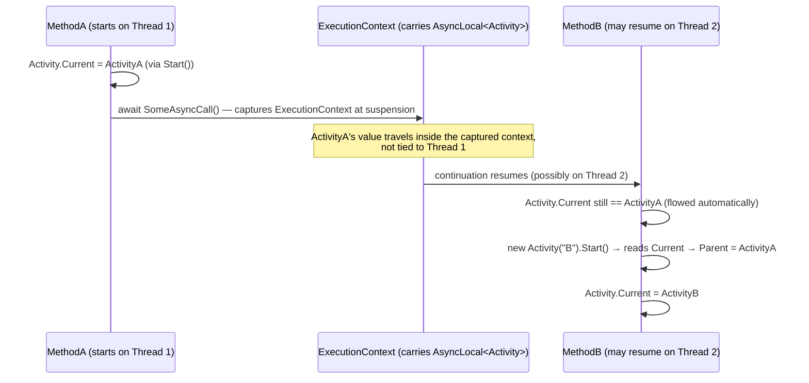

**TL;DR:** Does keeping a request's correlation ID or trace context attached across a chain of `async`/`await` calls require passing a context object through every method signature? No — .NET's `AsyncLocal<T>` already flows its current value across `await` automatically, following the *logical* call even when the actual continuation resumes on a different thread-pool thread. `System.Diagnostics.Activity.Current` is built directly on this primitive, and every new `Activity` automatically reads it as its own parent — producing a correctly-nested trace tree from ordinary async code, with zero explicit correlation-ID threading anywhere in application logic.

## 1. The Engineering Problem

Correlating everything that happens during one logical request — across multiple async method calls, possibly hopping between thread-pool threads along the way — needs some notion of "the current operation" that's reachable from deep inside a call chain without every intermediate method explicitly accepting and forwarding a context parameter. Two naive approaches both fail:

- **Threading a correlation-ID parameter through every method signature** works, but it's invasive — every method in the call chain, including ones that have nothing to do with tracing, needs an extra parameter, and it's trivially easy for someone adding a new method to forget to pass it through, silently breaking the chain at exactly that point.
- **A plain thread-static variable** (`[ThreadStatic]`) is transparent to call signatures, but breaks specifically because of how async works: a single logical async operation frequently *resumes on a different physical thread* than the one it started on, once it hits an `await` that yields control back to the thread pool. A thread-static "current operation" would show whatever was last set on *that* thread — which could be unrelated work from a different logical request entirely — the moment execution resumes somewhere else.

## 2. The Technical Solution

.NET's `AsyncLocal<T>` solves exactly this by being carried inside `ExecutionContext` rather than being tied to a physical thread. When an async method awaits something that isn't already complete, the runtime captures the current `ExecutionContext` (which holds every `AsyncLocal<T>`'s current value) at that suspension point, and restores that captured context when the continuation actually runs — regardless of which thread-pool thread ends up executing it. The *logical* flow of control carries the value; the physical thread doesn't matter.

`System.Diagnostics.Activity.Current` — the property every tracing/correlation mechanism in .NET, including OpenTelemetry's own instrumentation, is ultimately built on — is implemented as nothing more exotic than a static `AsyncLocal<Activity?>`. And critically, `Activity.Start()` automatically reads `Current` as the new activity's parent whenever no explicit parent was set — so starting a new activity anywhere inside an already-running async operation automatically produces the correct parent/child link, entirely as a side effect of `AsyncLocal`'s own flow, with no manual correlation-ID passing anywhere in the calling code.



Two core truths this diagram is showing:

- **The thread that resumes execution after an `await` doesn't matter to `Activity.Current`'s correctness.** `ExecutionContext` capture-and-restore is what makes the "current" value follow the logical call chain instead of whatever thread happens to be free when the continuation is scheduled.
- **Parent-child linking happens automatically, purely from reading `Current` at `Start()` time.** No code anywhere has to say "ActivityB's parent is ActivityA" explicitly — it falls out of `Start()` reading whatever `Current` already held at that point in the (correctly-flowed) async call chain.

## 3. The clean example (concept in isolation)

```csharp
// AsyncLocal<T>: correctly flows across await, regardless of thread hops.
static readonly AsyncLocal<string> CurrentCorrelationId = new();

async Task OuterAsync()
{
    CurrentCorrelationId.Value = "req-123";
    await InnerAsync();   // may resume on a different thread-pool thread
}

async Task InnerAsync()
{
    await Task.Delay(10);                          // a real await — thread may change here
    Console.WriteLine(CurrentCorrelationId.Value);  // still "req-123", correctly flowed
}

// [ThreadStatic]: breaks the moment a continuation resumes on a different thread.
[ThreadStatic] static string ThreadStaticCorrelationId;

async Task BrokenOuterAsync()
{
    ThreadStaticCorrelationId = "req-123";
    await Task.Delay(10);   // if the continuation resumes on a different thread...
    Console.WriteLine(ThreadStaticCorrelationId);  // ...this may now be null or stale
}
```

Both variables are set the same way syntactically — the difference is entirely in what the runtime does with each one across the `await` boundary.

## 4. Production reality (from the real repo)

```
runtime/src/libraries/System.Diagnostics.DiagnosticSource/src/System/Diagnostics/
└── Activity.cs             — s_current (AsyncLocal), Current property, Start()'s parent linking
```

`Activity.Current` is a static `AsyncLocal<Activity?>` field, with the property's own doc comment stating the flowing behavior directly:

```csharp
private static readonly AsyncLocal<Activity?> s_current = new AsyncLocal<Activity?>();

/// <summary>
/// Gets or sets the current operation (Activity) for the current thread. This flows
/// across async calls.
/// </summary>
public static Activity? Current
{
    get { return s_current.Value; }
    set
    {
        if (ValidateSetCurrent(value))
        {
            SetCurrent(value);
        }
    }
}
```

`Start()` is where the automatic parent-child linking actually happens — it reads `Current` *before* overwriting it, and uses that previous value as the new activity's parent:

```csharp
public Activity Start()
{
    if (_id != null || _spanId != null)
    {
        NotifyError(new InvalidOperationException(SR.ActivityStartAlreadyStarted));
    }
    else
    {
        _previousActiveActivity = Current;
        if (_parentId == null && _parentSpanId is null)
        {
            if (_previousActiveActivity != null)
            {
                // The parent change should not form a loop. We are actually guaranteed this because
                // 1. Un-started activities can't be 'Current' (thus can't be 'parent'), we throw if you try.
                // 2. All started activities have a finite parent chain (by inductive reasoning).
                Parent = _previousActiveActivity;
            }
        }
        // ...
    }
    return this;
}
```

What this teaches that a hello-world can't:

- **`_previousActiveActivity = Current` is read before the new activity becomes `Current` itself.** This ordering is exactly what lets `Start()` capture "whatever was running when I began" as the parent, without the caller ever having to explicitly pass a parent reference.
- **The doc comment "This flows across async calls" is a direct, literal claim about `AsyncLocal<T>`'s runtime behavior, not documentation aspiration.** It's true specifically because `s_current` is declared as `AsyncLocal<Activity?>` rather than any thread-bound storage — the flowing behavior is a property of the CLR's `ExecutionContext` mechanism, inherited automatically by using that type.
- **Nothing in `Start()` or `Current` references threads, `Task`, or `async`/`await` at all.** The correctness across async boundaries isn't something `Activity` implements itself — it's entirely delegated to `AsyncLocal<T>`'s own semantics, which is exactly why `Activity` (and everything built on it, including OpenTelemetry's .NET SDK) gets this correctness "for free" rather than having to reimplement context-flowing logic.

## 5. Review checklist

- **Does any code path deliberately suppress `ExecutionContext` flow** (e.g. via `ExecutionContext.SuppressFlow()`, or explicit `Task.Run` usage patterns that detach from the ambient context for performance reasons) **in a place where `Activity.Current` correctness is actually needed downstream?** Suppressing flow is a real, sometimes-legitimate performance optimization, but it silently breaks the automatic parent-linking this lesson describes for any activity started after that point.
- **Is a genuinely "fire and forget" background operation (not awaited by its caller) still expected to correlate back to the request that triggered it?** An un-awaited `Task` still captures `ExecutionContext` at the point it starts, but if that background work outlives the originating request's own activity lifecycle, relying on `Activity.Current` there needs a deliberate decision about whether that's the desired trace-tree shape.
- **For a manually-created `Activity` (not created through an `ActivitySource` your instrumentation library manages), is `.Start()` actually called before other code expects `Activity.Current` to reflect it?** An activity object that's constructed but never started never becomes `Current` and never gets the automatic parent-linking behavior described here.
- **When debugging a broken or missing parent-child link in a real trace, is the actual cause a thread-hop that legitimately shouldn't have broken flow — or a spot where `ExecutionContext` flow was intentionally or accidentally suppressed?** Distinguishing these two explains very different classes of bugs.

## 6. FAQ

**Q: Does `AsyncLocal<T>` mean the SAME `Activity` object is shared across concurrent async operations that both started from the same parent?**
A: No — each async continuation gets its own logical copy of the `ExecutionContext` (and thus its own view of `AsyncLocal<T>.Value`) at the point it branches off; setting `Activity.Current` in one concurrent branch doesn't affect what another concurrent branch sees. This is what makes it safe for multiple parallel operations (e.g. several `Task.WhenAll`-awaited calls) to each start their own child activities without interfering with each other's "current" value.

**Q: Is `Activity.Current` the same mechanism OpenTelemetry's .NET SDK uses, or does OpenTelemetry maintain its own separate context?**
A: The same one — OpenTelemetry's .NET instrumentation is explicitly built on top of `System.Diagnostics.Activity`/`ActivitySource` rather than inventing a parallel context-propagation mechanism, which is precisely why this domain's earlier "OpenTelemetry instrumentation" lesson could describe `Activity`-based APIs as OpenTelemetry's real underlying primitives.

**Q: What happens to `Activity.Current` across a genuine thread boundary that isn't part of `async`/`await` at all — like manually calling `new Thread(...).Start()`?**
A: A manually created `Thread` does not automatically capture and flow the creating thread's `ExecutionContext` the way `Task`-based async continuations do by default — so `Activity.Current` inside that new thread's entry method would not reflect the value set on the thread that created it, unless the code explicitly captures and restores the `ExecutionContext` itself. This is a real, structural difference between raw `Thread` usage and the `Task`/`async`-`await` model this lesson's flowing guarantee depends on.

**Q: Could a bug in application code accidentally overwrite `Activity.Current` in a way that corrupts the trace tree for everything downstream?**
A: Yes — since `Activity.Current` is a mutable, settable property, code that manually assigns `Activity.Current = someActivity` without going through the normal `Start()`/dispose lifecycle can desynchronize it from what instrumentation libraries expect, producing an incorrect parent chain for anything started afterward in that async flow. This is exactly why application code is expected to create activities through `ActivitySource.StartActivity()` (which manages this lifecycle correctly) rather than manipulating `Activity.Current` directly.

---

## Source

- **Concept:** Automatic trace-context propagation across async boundaries via `AsyncLocal<T>`
- **Domain:** observability
- **Repo:** [dotnet/runtime](https://github.com/dotnet/runtime) → [`src/libraries/System.Diagnostics.DiagnosticSource/src/System/Diagnostics/Activity.cs`](https://github.com/dotnet/runtime/blob/main/src/libraries/System.Diagnostics.DiagnosticSource/src/System/Diagnostics/Activity.cs) — the real, first-party .NET tracing primitive OpenTelemetry's .NET SDK is built on
