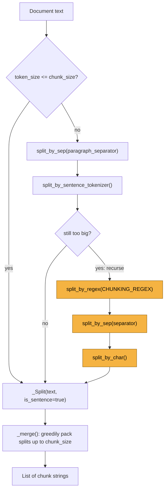
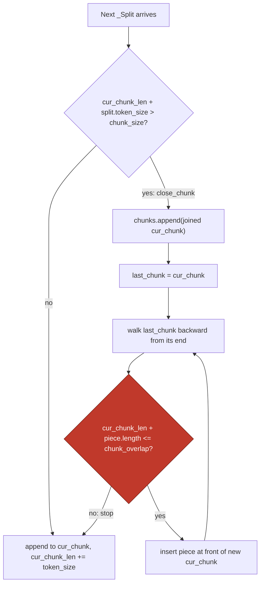
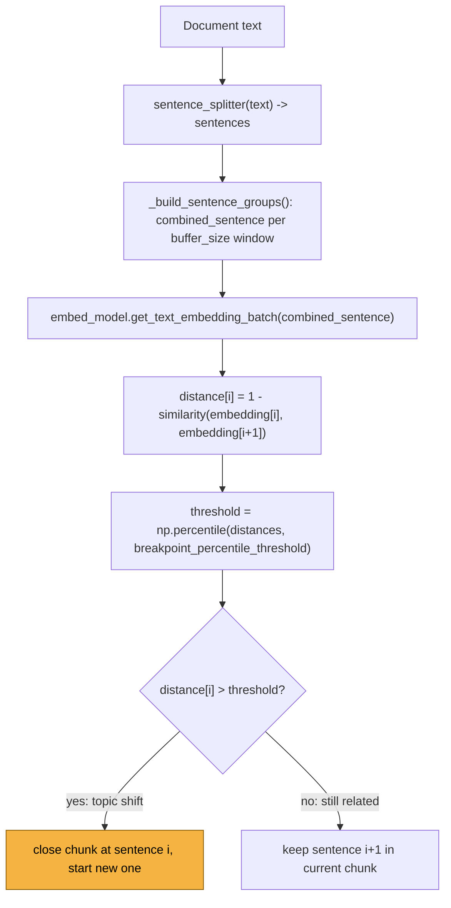

**TL;DR:** Does chunking just mean cutting a document every N characters or tokens? No — naive fixed-size splitting routinely slices through a sentence or a table row, and the resulting chunk's embedding represents a fragment of an idea rather than the idea itself, which quietly degrades retrieval without ever throwing an error. `llama_index`'s `SentenceSplitter` fixes this with a hierarchical split-then-merge pipeline that prefers sentence boundaries and only falls back to smaller units when it has to; its `SemanticSplitterNodeParser` goes further and chunks on *meaning* shifts — measured as embedding-distance breakpoints between adjacent sentences — instead of a token budget at all.

## 1. The Engineering Problem

RAG (from this domain's previous lesson) depends on embedding chunks of a document so they can be retrieved by similarity later. The obvious first approach is to slice the raw text every `N` characters: fast, deterministic, no dependencies. It also has no idea where a sentence, a paragraph, or a table row ends.

Cut a sentence in half and both halves get embedded — one as an incomplete clause, one as a dangling continuation. Neither vector represents the sentence's actual meaning, so a query that should retrieve that sentence may not match either half strongly enough to surface it. The failure mode is silent: no exception, no malformed output, just a chunk that's quietly worse at being found than it should be. This is the exact "avoidable source of RAG quality problems" this domain's curriculum calls out as a known-stale-fact — fixed-size chunking is a real, common cause of bad retrieval, not a theoretical nitpick.

A second problem sits underneath the first: what should "size" even be measured in? Characters don't correspond to what the embedding and generation models actually consume — they consume subword tokens, and a chunk sized in characters can wildly over- or under-shoot the model's real token budget depending on the text's language and punctuation density.

## 2. The Technical Solution

`llama_index` ships two structurally different chunkers that solve this in opposite ways — one still chunks by size but respects structure, the other abandons size as the primary signal entirely.

**`SentenceSplitter`** treats `chunk_size` as a token budget (counted with a real tokenizer, not `len()`) and splits *hierarchically*: try to keep the text whole; if it's too big, split by paragraph separator; if a paragraph is still too big, split by sentence; if a sentence is still too big, fall back to a regex-based clause splitter, then a plain separator, then individual characters — descending to a smaller unit only when the current one won't fit. The pieces are then greedily re-merged into chunks up to `chunk_size`, carrying a token-overlap window forward from the end of one chunk into the start of the next.

**`SemanticSplitterNodeParser`** doesn't use a token budget as the primary breakpoint signal at all. It embeds every sentence (grouped with its neighbors via a `buffer_size` window for context), measures cosine distance between each adjacent pair of sentence-group embeddings, and cuts wherever that distance exceeds a percentile threshold across the whole document — i.e., wherever the topic actually shifts. Chunks end up variable-length, sized by where the content changes, not by a fixed count.

Three core truths to hold:

- Chunk size in `SentenceSplitter` is real subword tokens (`tiktoken`'s `gpt-3.5-turbo` encoding by default via `get_tokenizer()`), not characters or words.
- `SentenceSplitter`'s splitting is a *fallback ladder*, not one strategy — paragraph → sentence → regex clause → separator → character — and it only descends a rung when the current unit still exceeds `chunk_size`.
- `SemanticSplitterNodeParser` replaces "how many tokens fit" with "where does the topic change," using `np.percentile` over cosine distances between adjacent sentence-group embeddings as the actual cut signal.



The merge step is where the token-overlap actually happens, and it's not "copy the last N characters" — it walks backward through the *previous* chunk's already-sized pieces, adding whole pieces to the front of the new chunk until adding one more would exceed `chunk_overlap`:



For the semantic path, the breakpoint is computed once per document, from a distance array over adjacent sentence groups:



## 3. The clean example (concept in isolation)

A minimal split-then-merge-with-overlap, isolated from `llama_index`'s tokenizer, callback manager, and Pydantic fields — same shape as `SentenceSplitter._split`/`_merge`, but on plain character counts so the mechanism reads clearly on its own:

```python
def chunk_with_overlap(sentences: list[str], max_size: int, overlap: int) -> list[str]:
    """Greedily pack whole sentences into chunks <= max_size, carrying
    `overlap` characters of the previous chunk's tail into the next chunk."""
    chunks: list[str] = []
    current: list[str] = []
    current_len = 0

    for sentence in sentences:
        # A sentence never gets split mid-way here — if it alone exceeds
        # max_size it becomes its own oversized chunk (the real splitter
        # would recurse to a smaller unit instead; omitted for clarity).
        if current_len + len(sentence) > max_size and current:
            chunks.append("".join(current))

            # Carry overlap forward: walk the just-closed chunk backward,
            # keeping whole sentences until the overlap budget is used up.
            tail, tail_len = [], 0
            for s in reversed(current):
                if tail_len + len(s) > overlap:
                    break
                tail.insert(0, s)
                tail_len += len(s)

            current, current_len = tail, tail_len

        current.append(sentence)
        current_len += len(sentence)

    if current:
        chunks.append("".join(current))
    return chunks
```

The two ideas this isolates: pack greedily until the next piece would overflow, then *carry whole units backward* into the next chunk rather than an arbitrary character slice — cutting overlap mid-sentence would reintroduce the exact fragment problem chunking is supposed to solve.

## 4. Production reality (from the real repo)

Both files live under the same package, one level apart:

```
llama-index-core/llama_index/core/node_parser/
├── text/
│   ├── sentence.py            # SentenceSplitter: fallback-ladder split + merge
│   └── semantic_splitter.py   # SemanticSplitterNodeParser: embedding-distance breakpoints
```

`SentenceSplitter._split` — the fallback ladder in code. Note it only recurses when there's more than one piece to recurse into; a single indivisible unit larger than `chunk_size` (e.g. one abnormally long token) is kept as-is rather than looping forever:

```python
def _split(self, text: str, chunk_size: int) -> List[_Split]:
    token_size = self._token_size(text)
    if token_size <= chunk_size:
        return [_Split(text, is_sentence=True, token_size=token_size)]

    text_splits_by_fns, is_sentence = self._get_splits_by_fns(text)

    text_splits = []
    for text_split_by_fns in text_splits_by_fns:
        token_size = self._token_size(text_split_by_fns)
        if token_size <= chunk_size:
            text_splits.append(
                _Split(text_split_by_fns, is_sentence=is_sentence, token_size=token_size)
            )
        elif len(text_splits_by_fns) == 1:
            # Single indivisible unit bigger than chunk_size — keep it rather
            # than recurse on identical input and loop forever.
            text_splits.append(
                _Split(text_split_by_fns, is_sentence=is_sentence, token_size=token_size)
            )
        else:
            recursive_text_splits = self._split(text_split_by_fns, chunk_size=chunk_size)
            text_splits.extend(recursive_text_splits)
    return text_splits
```

`SentenceSplitter._merge`'s overlap logic — `close_chunk()` walks `last_chunk` backward, inserting whole `(text, length)` pieces at the front of the new chunk while they still fit inside `chunk_overlap`:

```python
def close_chunk() -> None:
    nonlocal chunks, cur_chunk, last_chunk, cur_chunk_len, new_chunk
    chunks.append("".join([text for text, length in cur_chunk]))
    last_chunk = cur_chunk
    cur_chunk = []
    cur_chunk_len = 0
    new_chunk = True

    # add overlap to the next chunk using the last one first
    if len(last_chunk) > 0:
        last_index = len(last_chunk) - 1
        while (
            last_index >= 0
            and cur_chunk_len + last_chunk[last_index][1] <= self.chunk_overlap
        ):
            overlap_text, overlap_length = last_chunk[last_index]
            cur_chunk_len += overlap_length
            cur_chunk.insert(0, (overlap_text, overlap_length))
            last_index -= 1
```

`SemanticSplitterNodeParser._build_node_chunks` — the breakpoint cut, straight from a percentile over the distance array:

```python
def _build_node_chunks(self, sentences, distances) -> List[str]:
    chunks = []
    if len(distances) > 0:
        breakpoint_distance_threshold = np.percentile(
            distances, self.breakpoint_percentile_threshold
        )
        indices_above_threshold = [
            i for i, x in enumerate(distances) if x > breakpoint_distance_threshold
        ]

        start_index = 0
        for index in indices_above_threshold:
            group = sentences[start_index : index + 1]
            chunks.append("".join([d["sentence"] for d in group]))
            start_index = index + 1

        if start_index < len(sentences):
            chunks.append("".join([d["sentence"] for d in sentences[start_index:]]))
    else:
        chunks = [" ".join([s["sentence"] for s in sentences])]
    return chunks
```

What this teaches that a hello-world can't:

- **Overlap is a piece-carry, not a character slice.** `close_chunk()` only ever inserts whole previously-sized `(text, length)` tuples — it cannot reintroduce a half-sentence fragment, because the pieces being carried were already sized as complete sentences/clauses upstream in `_split`.
- **`chunk_overlap > chunk_size` is rejected at construction time**, not discovered mid-run — `SentenceSplitter.__init__` raises `ValueError` immediately, because an overlap larger than the chunk itself makes the merge loop nonsensical.
- **The semantic splitter has no `chunk_size` field at all.** `_build_node_chunks` never checks a token count — the only input to where a chunk ends is the distance array's percentile, so chunk length is an *output* of the algorithm, not a constraint fed into it.
- **`np.percentile` makes the threshold document-relative.** The same `breakpoint_percentile_threshold=95` produces a different absolute distance cutoff on every document, because it's computed from that document's own distance distribution — a technical document with uniformly short sentences and a narrative one with long flowing sentences don't share a fixed cutoff.

## 5. Review checklist

- If reviewing a `SentenceSplitter` config, confirm `chunk_overlap < chunk_size` — not just that it *isn't rejected* at construction, but that the ratio leaves enough room for `close_chunk()` to actually carry more than a token or two forward.
- If the corpus isn't English prose (code, logs, CJK text, tables), check whether `secondary_chunking_regex` (`CHUNKING_REGEX`, which matches on `,.;。？！`) can find any boundary at all in that text — if it can't, the fallback ladder bottoms out at `split_by_char()`, which is exactly the mid-word fragmentation this whole mechanism exists to avoid.
- If reviewing a `SemanticSplitterNodeParser` config, check `breakpoint_percentile_threshold` against the actual chunk count it produced on a sample document — 95 means only the top 5% most dissimilar adjacent-sentence gaps become cuts, so a document with genuinely frequent topic shifts may need a lower threshold to avoid under-splitting.
- Confirm the tokenizer used for `chunk_size` accounting (`get_tokenizer()`'s default is a `gpt-3.5-turbo` `tiktoken` encoding) actually matches the model doing the embedding or generation downstream — a mismatched tokenizer under- or over-counts tokens relative to what the real model will see.

## 6. FAQ

**Q: Why does `SentenceSplitter` recurse through four different split functions instead of just truncating at `chunk_size` characters?**
A: Truncating mid-unit is exactly the fragmentation problem this lesson opened with. Each fallback rung (paragraph → sentence → regex clause → separator → character) is tried only when the current rung still produces a piece bigger than `chunk_size`, so the splitter always keeps the *largest* structurally meaningful unit that still fits, and only descends further when it has to.

**Q: What happens when a single sentence — one indivisible unit — is still bigger than `chunk_size` after `_get_splits_by_fns` runs out of splitters?**
A: `_split` checks `len(text_splits_by_fns) == 1` and keeps that oversized piece as-is rather than recursing on identical input (which would loop forever and raise `RecursionError`). `_merge` then hits `if cur_split.token_size > chunk_size: raise ValueError("Single token exceeded chunk size")` — a real, explicit failure instead of silent truncation.

**Q: Is the token-overlap between chunks a fixed slice of the previous chunk's text?**
A: No — `close_chunk()` walks `last_chunk` backward one already-sized `(text, length)` piece at a time, inserting each into the new chunk only while `cur_chunk_len + length <= self.chunk_overlap` holds. The overlap length varies chunk-to-chunk depending on how the previous chunk happened to be composed of pieces.

**Q: Why does `SemanticSplitterNodeParser` produce wildly different chunk sizes across documents, while `SentenceSplitter` chunks converge on roughly `chunk_size` tokens?**
A: They optimize for different things. `SentenceSplitter` treats `chunk_size` as the constraint and packs greedily toward it. `SemanticSplitterNodeParser` has no size constraint in `_build_node_chunks` at all — its only cut signal is `distance[i] > np.percentile(distances, threshold)`, so a document with long uniform sections produces long chunks and one with frequent topic shifts produces short ones, regardless of token count.

**Q: Does raising `breakpoint_percentile_threshold` produce more chunks or fewer?**
A: Fewer, larger chunks. A higher percentile raises `breakpoint_distance_threshold`, so fewer of the adjacent-sentence distances in `distances` exceed it, `indices_above_threshold` shrinks, and `_build_node_chunks` closes out chunks less often — the inverse of what the field's own docstring states ("lower value will generate more nodes") is worth double-checking against this code path directly if a config seems to produce an unexpected chunk count.

---

## Source

- **Concept:** Chunking strategies for RAG (fixed-size hierarchical splitting vs. semantic embedding-distance splitting)
- **Domain:** genai
- **Repo:** [run-llama/llama_index](https://github.com/run-llama/llama_index) → [`llama-index-core/llama_index/core/node_parser/text/sentence.py`](https://github.com/run-llama/llama_index/blob/main/llama-index-core/llama_index/core/node_parser/text/sentence.py) and [`llama-index-core/llama_index/core/node_parser/text/semantic_splitter.py`](https://github.com/run-llama/llama_index/blob/main/llama-index-core/llama_index/core/node_parser/text/semantic_splitter.py) — a real, dedicated open-source RAG/data framework for LLM applications.
